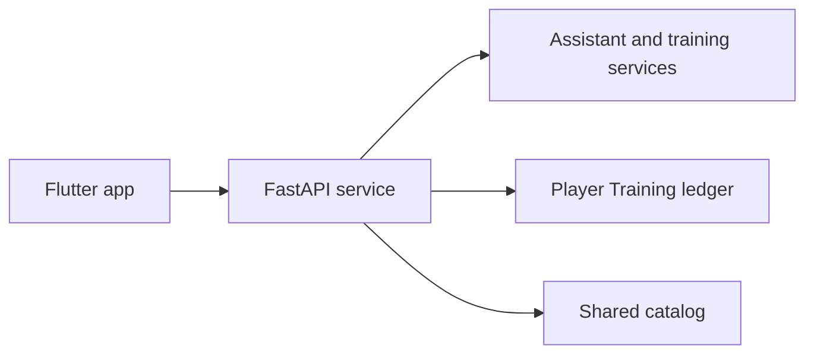

<a id="readme-top"></a>

<div align="center">

[](https://www.python.org/)
[](https://www.docker.com/)
[](https://fastapi.tiangolo.com/)
[](https://github.com/langchain-ai/langgraph)
[](https://github.com/asg017/sqlite-vec)
[](LICENSE)

</div>

<!-- PROJECT LOGO -->
<br />
<div align="center">
  <h1 align="center">⚡ MAYOS</h1>
  <p align="center">
    <b>Training Ledger & Biomechanics Engine with Hosted Assistant Inference</b>
    <br />
    <i>Deterministic auto-regulation, sub-millisecond triage routing, JWT-secured multi-tenant ledgers, and fractional volume attribution with hosted chat inference.</i>
    <br />
    <br />
    <a href="#quickstart">Quickstart</a>
    ·
    <a href="#system-architecture">Architecture</a>
    ·
    <a href="#accounts--security">Accounts & Security</a>
    ·
    <a href="#technical-documentation">Documentation Index</a>
  </p>
</div>

---

## Overview

**Mayos** is a privacy-conscious workout ledger and biomechanics engine. Chat uses a hosted OpenAI-compatible model; embeddings for clinical checks and catalog search run locally.

Commercial fitness trackers rely on rigid linear progressions and binary volume attribution that inflate synergistic muscle tracking. Conversely, naive AI agents route every prompt through an LLM, incurring multi-second inference bottlenecks just to classify basic user intents.

Mayos bridges this gap:

* **Hosted Chat, Local Embeddings**: Player, judge, and coach chat use hosted OpenAI-compatible models. The clinical guard and Exercise library search keep their embedding model local.
* **Deterministic Fast-Path Router**: Clinical trauma halts, movement swaps, and split mutations are resolved by compiled regex and ledger logic in **0.014–0.075 ms** — up to **375,000× faster** than an LLM classification call — while a Tier-1 semantic guard keeps colloquial injury reports safe.
* **Biomechanical Auto-Regulation**: Quantizes weights to 2.5 kg Olympic increments, calculates dynamic RPE-adjusted effective 1RMs, and tracks synergists fractionally (0.5 sets).
* **JWT-Secured Multi-Tenant Ledgers**: The FastAPI service checks HS256 tokens against a durable account registry for status, player capability, and session epoch, then checks the ledger revocation list. Each user has an isolated SQLite ledger in WAL mode with an in-process `sqlite-vec` semantic catalog.
* **Self-Service Account Recovery**: Recovery-email endpoints, single-use hashed reset tokens with anti-enumeration responses, revoke-all password changes, and an operator CLI backstop. The Flutter app guides a Player through recovery-email setup.

---

## Technical Documentation

Detailed architectural specifications, benchmarks, and mathematical proofs are maintained in dedicated modules within [`docs/`](docs/):

| Document | Focus & Contents |
| :--- | :--- |
| [**Architecture Specification**](docs/ARCHITECTURE.md) | Mermaid state graphs, deterministic fast-path routing tiers, service-layer request lifecycle, chunk sanitization, and connection topologies. |
| [**Authentication & Recovery**](docs/AUTHENTICATION.md) | JWT claims and verification, registry session epochs, revocation ledgers, recovery email, single-use reset tokens, and operator runbooks. |
| [**Empirical Benchmarks**](docs/ARCHITECTURAL_BENCHMARKS.md) | Deterministic routing latency, context clamping, WAL concurrency, and historical evaluation results. |
| [**Progression & Biomechanics**](docs/PROGRESSION_RULES.md) | Mathematical formulations for effective 1RMs, Olympic plate quantization, warmup ramps, deload rules, and clinical interception boundaries. |
| [**Deployment Runbook**](docs/DEPLOYMENT.md) | Fly.io closed-trial API topology (single always-on writer, durable `/data` volume, hosted inference), Docker Compose orchestration, local embedding configuration, auth operations, and disaster recovery. |
| [**Decision Records**](DECISIONS.md) | ADRs 001–020: engine safeguards, account and coaching rules, hosted inference, mobile migration, and offline sync. |

---

## System Architecture



> For detailed sequence diagrams, state machines, and the service-layer request lifecycle, refer to [`docs/ARCHITECTURE.md`](docs/ARCHITECTURE.md).

---

## Quickstart

### Prerequisites

* Docker Engine with Docker Compose v2.
* An OpenAI-compatible provider API key.
* CPU resources for the local embedding model.

### 1. Configure secrets

`docker compose up` **requires** `JWT_SECRET` and `LLM_API_KEY`; the stack fails fast without either. Copy the template, fill in the hosted API key, and export a generated JWT secret:

```bash
git clone https://github.com/ahmedtvmer/myos.git
cd myos
cp .env.example .env

# Generate and export the JWT signing secret (compose reads it from the environment)
export JWT_SECRET="$(python -c 'import secrets; print(secrets.token_hex(32))')"
```

> The exported JWT value takes precedence over `.env`. If you rely on the file, replace the `changeme…` placeholder.

### 2. Initialize the catalog & semantic index (one time)

```bash
docker compose run --rm myos-api python scripts/intialize_db.py
docker compose run --rm myos-api python scripts/seed_vectors.py
```

### 3. Launch

```bash
docker compose up -d
```

The FastAPI service is available at **`http://localhost:8000`** and its OpenAPI page at **`http://localhost:8000/docs`**. Connect the Flutter app to that API and complete Player onboarding there. The API sends chat requests to the hosted endpoint configured by `LLM_API_BASE` and `LLM_API_KEY`.

<details>
  <summary><b>Local Python Installation (Native, two processes)</b></summary>
  <br />

  Run the FastAPI service directly:

  ```bash
  uv venv
  source .venv/bin/activate
  uv pip install -r requirements.txt

  uv run python scripts/intialize_db.py
  uv run python scripts/seed_vectors.py

  # Set JWT_SECRET first, then start the API
  export JWT_SECRET="$(python -c 'import secrets; print(secrets.token_hex(32))')"
  uv run uvicorn svc.app:app --host 0.0.0.0 --port 8000 --workers 1

  ```
</details>

---

## Performance Highlights

* **Standard Evaluation Suite (65 cases)**: **96.9% (63/65)** pass rate — 25/25 Coaching Q&A, 25/25 Post-Workout Debrief, 13/15 Onboarding (LLM-as-a-judge, strict 5/5 on clinical safety and groundedness; the two misses are onboarding extraction-fidelity bugs, not safety regressions).
* **Unseen Generalization (15 cases)**: **100% (15/15)** pass rate on novel movements, inverted syntax, and third-party contraindication traps.
* **Up to ~375,000× Latency Elimination**: Pure-regex paths resolve in 0.014–0.075 ms; the guard-inclusive deterministic router averages **17 ms** against a **5.6 s** LLM classification call (**≈329× on average, never below ≈157×**).
* **Flat Clamped Latency**: A 6-message context tail (`TAIL_WINDOW_SIZE = 6`) plus compact telemetry holds a **~4.2 s asymptotic ceiling** regardless of conversation length — 2.4× faster than an unclamped pipeline by turn 30.
* **Zero Math Hallucination**: Offloads e1RM tracking, Olympic barbell plate distribution, and volume tonnage directly to deterministic Python algorithms.
* **Chat roles are hosted-only**: Player, judge, and coach use the hosted model factory; local BGE embeddings remain available for clinical triage and catalog search.

> Review the full empirical benchmark tables and context scaling curves in [`docs/ARCHITECTURAL_BENCHMARKS.md`](docs/ARCHITECTURAL_BENCHMARKS.md).

---

## Accounts & Security

Mayos ships a complete self-hosted identity layer — no cloud IdP, no external auth service:

* **JWT sessions (HS256)**: `sub` + `jti` + `tv` (session epoch) claims, 2-hour default expiry, per-token revocation on logout.
* **Optional remember-me sessions**: with explicit consent, the browser stores a sign-in cookie; remembered tokens last 30 days (`JWT_REMEMBER_ME_HOURS`) so refreshes keep you logged in. Password changes and logout still revoke them instantly (ADR 010).
* **Revoke-all password changes**: for enrolled accounts, password changes and resets advance the catalog registry session epoch, invalidating existing sessions (ADR 006/015). The operator CLI also supports bare local ledgers through their ledger token version.
* **Recovery email**: the Flutter app collects a recovery address, and the API exposes recovery-email endpoints without treating it as an access gate.
* **Forgot / reset password**: single-use SHA-256-hashed tokens (30-min TTL, atomic consumption, weak passwords rejected before the token is burned), with identical responses for known and unknown emails.
* **Anti-enumeration posture**: unknown users and wrong passwords are indistinguishable; recovery requests never reveal whether an address is linked.
* **Strict rate limits**: 5/min login & register, 3/hour recovery, 10/min password operations, 30/min chat.
* **Operator backstop**: `scripts/reset_password.py <trainee_id>` resets any ledger from the console and revokes all its sessions — no email required.
* **Email delivery is optional**: configure SMTP, or leave `SMTP_HOST` unset for console-dev mode (reset links logged server-side — development only).

Full specification, sequence diagrams, and environment reference: [`docs/AUTHENTICATION.md`](docs/AUTHENTICATION.md).

---

## Biomechanical Engine Overview

Unlike generic trackers, Mayos embeds exercise physiology rules into its transaction layer:

* **Dynamic RPE Scaling**: Computes effective 1RM using $w \cdot (1 + \text{effective\_reps}/30)$ to determine true velocity reserve without requiring failure sets.
* **RPE 10 Overshoot Protection**: Drops subsequent session loads by 2.5 kg if an athlete overshoots target intensity.
* **Olympic Disc Snapping**: Snaps all calculated loads to 2.5 kg symmetric increments and outputs per-side plate breakdowns (e.g., `Bar + [25, 10, 1.25] kg/side`).
* **Fractional Synergist Tracking**: Direct working sets score 1.0 sets; secondary muscle contributors identified in the relational catalog receive 0.5 sets.
* **Context-Gated Clinical Interception**: Tier-0a halts on unconditional trauma signals (*"sharp pop"*, *"shooting pain"*) in ~0.02 ms; Tier-0b context-gates DOMS-ambiguous vocabulary (*"torn"*, *"swollen"*, *"tweaked"*) so gym slang like *"quads torn up from leg day"* coaches normally while *"felt a pop in my knee"* still halts.

> Detailed formulas, warmup ramp structures, and deload rules are documented in [`docs/PROGRESSION_RULES.md`](docs/PROGRESSION_RULES.md).

---

## Observability

Inference throughput and latency metrics are tracked silently to `logs/myos.log` without cluttering the user interface. Each coaching turn records router time, TTFT, token count, generation time, and TPS; sustained throughput below 8 TPS raises a `[PERF DEGRADATION]` warning for CPU thermal throttling or thread contention.

```bash
# Monitor real-time transaction telemetry
docker compose exec myos-api tail -f /app/logs/myos.log | grep "\[TELEMETRY\]"

# Run an on-demand engine latency & throughput audit
docker compose exec myos-api python scripts/check_engine_health.py
```

> Note: `GET /healthz` reports `model: false` whenever eager hosted-model warmup is skipped (`SKIP_LLM_LOAD=true`).

---

## Roadmap

- [x] Zero-regression architecture refactoring and multi-tenant WAL migration.
- [x] Sub-millisecond regex router, banned movement vetoes, and clinical safeguard interceptor.
- [x] Dynamic entity extraction and introspective ledger reconciliation layer.
- [x] Hybrid deterministic debrief architecture (zero-hallucination metrics).
- [x] Standard & generalization benchmark suites re-run on the refreshed stack (63/65 standard, 15/15 generalization).
- [x] Hosted chat streaming and tool-call support.
- [x] In-process `sqlite-vec` semantic exercise catalog search.
- [x] Fractional synergist volume attribution (1.0 direct / 0.5 synergist).
- [x] FastAPI service layer with JWT authentication, rate limiting, and SSE streaming.
- [x] Self-service password recovery, recovery-email endpoints, and operator reset CLI.
- [x] Context-gated Tier-0b clinical safety (DOMS slang vs. genuine trauma reports).
- [x] Hosted-only player, judge, and coach chat with bounded streaming inference; local embeddings retained for clinical triage and catalog search.
- [x] Export session logs to standardized CSV / JSON fitness exchange formats.
- [ ] Direct Apple HealthKit and Google Health Connect local synchronization.
- [ ] Email ownership verification (double opt-in) for recovery addresses.

---

## License

Distributed under the MIT License. See `LICENSE` for details.

---

## Contact

**Ahmed Tamer** — [ahmedhegazy4me@gmail.com](mailto:ahmedtamerhejazi@gmail.com)

Project Repository: [https://github.com/ahmedtvmer/myos](https://github.com/ahmedtvmer/myos)

<p align="right">(<a href="#readme-top">back to top</a>)</p>
