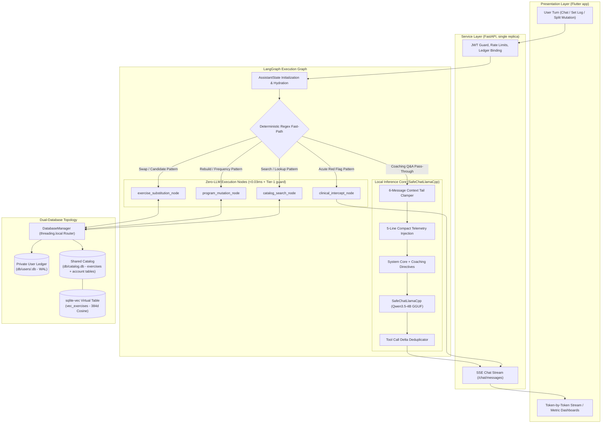
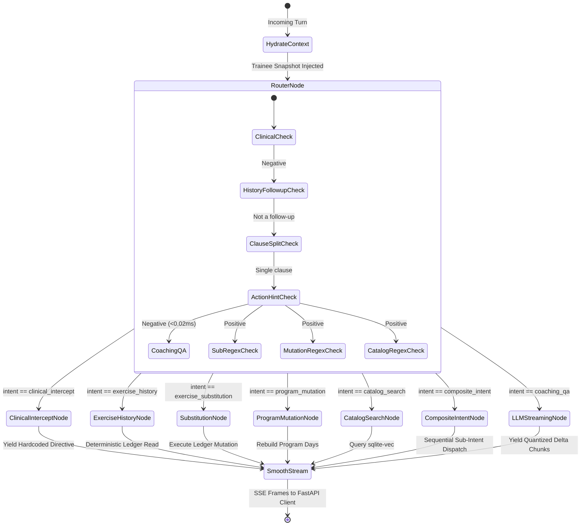
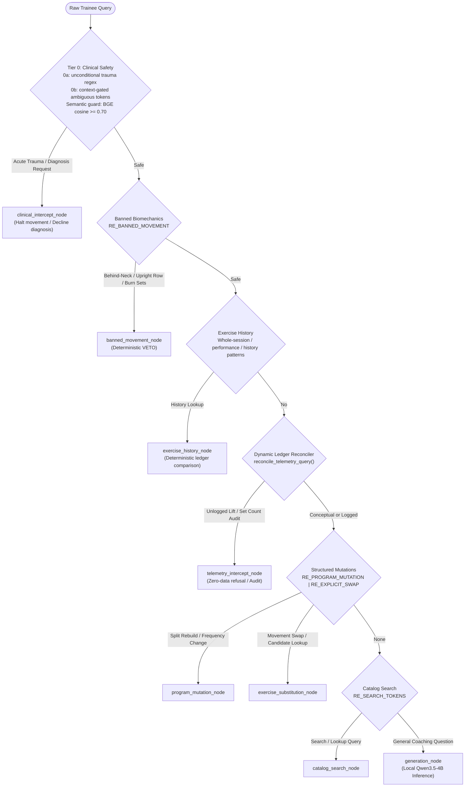
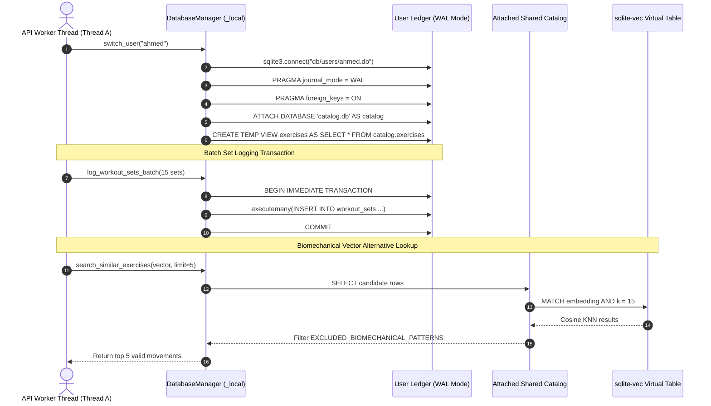
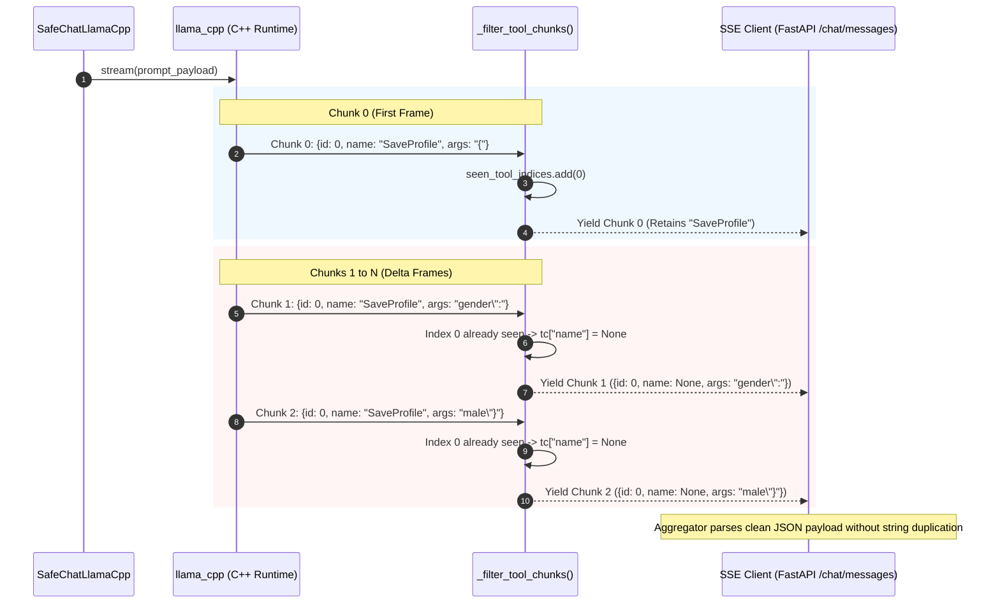
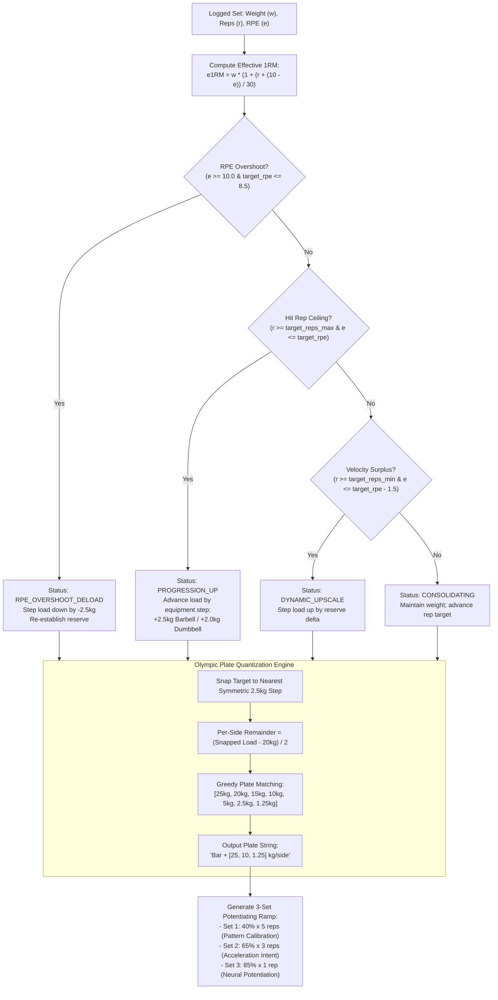
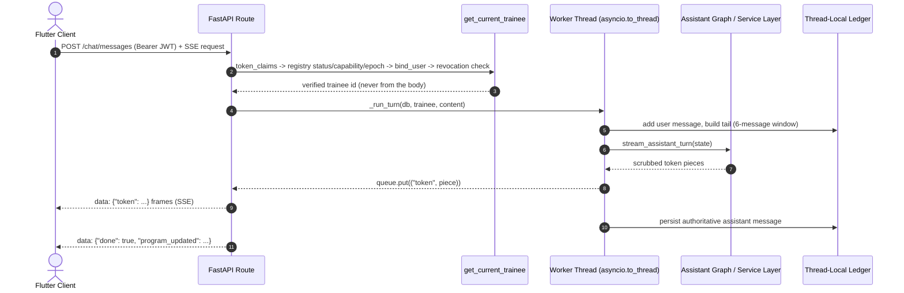

# Myos: System Architecture, LangGraph Workflows & Execution Topologies

This document provides a comprehensive architectural specification of the Myos engine, detailing state graphs, LangChain/LangGraph execution pipelines, sub-millisecond fast-path routing, data flow topologies, and runtime data contracts.

---

## 1. High-Level System Architecture

The following diagram illustrates the lifecycle of a trainee interaction, showing how the Flutter app (the product client; the legacy Streamlit interface serves no users per ADR 017) reaches the engine through the FastAPI service layer (JWT auth, rate limiting, SSE delivery), and how the LangGraph state engine, in-process vector database, and local quantized GGUF runtime interact:



> The service layer owns identity and transport: bearer JWTs are verified against the catalog account registry (status, capability, session epoch) and the ledger's revocation list before any graph node runs, and graph output is re-streamed as Server-Sent Events. See §9 for the full request lifecycle and [`AUTHENTICATION.md`](AUTHENTICATION.md) for the auth specification.

---

## 2. LangGraph State Schema & Data Contracts

The runtime state (`AssistantState`) flows immutably across nodes in `agent/assistant_graph.py`:

```python
IntentType = Literal[
    "clinical_intercept",
    "banned_movement",
    "telemetry_intercept",
    "exercise_history",
    "exercise_substitution",
    "program_mutation",
    "catalog_search",
    "coaching_qa",
    "composite_intent",
]


class AssistantState(TypedDict):
  messages: Annotated[Sequence[BaseMessage], add_messages]
  trainee_id: str
  coach_tone: str
  custom_instructions: str
  preferred_name: str | None
  telemetry_context: str | None
  intent: IntentType | None
  intent_metadata: dict[str, Any]
  active_intents: list[dict[str, Any]] | None
  program_updated: bool
  response_content: str | None
  pipeline_error: str | None
```

### State Node Execution Lifecycle



> Multi-clause turns (e.g. *"swap bench for incline press and how many reps for curls?"*) are split by `RE_CLAUSE_SPLIT` into per-clause sub-intents. `composite_intent_node` re-checks clinical safety across the whole turn, then dispatches each clause through its own handler with prior results injected as dialogue context.

---

## 3. Deterministic Fast-Path Routing Logic

The fast-path router eliminates LLM classification latency on routine user queries through a multi-tiered hierarchy of compiled regular expressions:



> Tier-0b is where DOMS slang is separated from genuine injury reports: ambiguous tokens (`swelling`, `tear/tore/torn`, `pop`, `tweaked`) only intercept with explicit injury context — mechanism perception (*"felt a pop"*), anatomical proximity (joints, tendons, pec/bicep/ACL…), or body-part objects. Fatigue idioms (*"torn up from leg day"*, *"tweaked my program"*, painless *"knees pop when"*) defer to the Tier-1 semantic guard. See ADR 002 in [`DECISIONS.md`](../DECISIONS.md).

---

## 4. Dual-Database Topology & Thread-Local Connection Model

Myos combines a shared exercise catalog (`catalog.db` — seeded exercises, the `sqlite-vec` index, and the account-recovery identity tables) with dynamic, isolated per-user transaction ledgers (`db/users/<user_id>.db`). The Flutter client never touches these directly: it calls the FastAPI service, and each API worker thread binds the ledger for the verified account through `DatabaseManager`'s `threading.local` routing. Cross-tenant leakage is physically impossible, and SQLite Write-Ahead Logging (`WAL`) prevents write contention:



### Ledger Schema Evolution (ADR 005)

User ledgers carry a schema version in `PRAGMA user_version` (current target: **v4**) and migrate **lazily** when mounted by `switch_user()`:

* On upgrade, an atomic pre-migration snapshot is written with `sqlite3.Connection.backup()` (WAL-safe, online) into `db/backups/<user>/`, followed by sequential migration steps inside a transaction.
* A 3+1 retention policy keeps three rolling snapshots plus immutable pre-migration backups; failure triggers rollback from the snapshot.
* **v3** adds `auth_credentials.token_version`; for enrolled accounts, the authoritative session epoch now lives in the catalog account registry (`accounts.session_epoch`) and is bumped on password changes and resets (ADR 006/015). An enrolled ledger without a password hash uses the one-time claim flow; a bare local ledger requires the opted-in import path (ADR 019).
* **v4** adds `personal_records` and backfills historical PRs (heaviest set per exact rep count + best e1RM) from `workout_sets` with first-achievement timestamps (ADR 009).

### Catalog Account Tables (ADR 007)

Password recovery needs an email → account mapping while **logged out**, so recovery identity lives in the shared catalog (not per-user ledgers):

| Table | Purpose |
| :--- | :--- |
| `trainee_emails` | Unique recovery address per account (keyed by immutable account id) |
| `password_reset_tokens` | SHA-256-hashed, single-use, TTL-clamped reset tokens (keyed by immutable account id) |

Both are provisioned idempotently at catalog boot. See [`AUTHENTICATION.md`](AUTHENTICATION.md) for the full specification.

---

## 5. Token Streaming & Tool-Call Sanitization Flow

To prevent `llama-cpp-python` streaming tool calls from corrupting Pydantic structured output parsers via repeated function name concatenation, `SafeChatLlamaCpp` intercepts the raw C++ chunk stream:



---

## 6. Biomechanical Auto-Regulation State Machine

During active workout logging in Tab 2, working sets are auto-regulated using RPE-adjusted effective 1RM calculations, Olympic barbell plate quantization, and fatigue thresholds:



---

## 7. Context Clamping & Telemetry Hydration Pipeline

To maintain flat inference latency and prevent token evaluation degradation across long training histories, Myos replaces full chat serialization with a bounded context pipeline:

```mermaid
flowchart LR
    subgraph Raw_History ["Persistent SQLite State"]
        H1["Turn 1...N-6 (Archived)"]
        H2["Turn N-5"]
        H3["Turn N-4"]
        H4["Turn N-3"]
        H5["Turn N-2"]
        H6["Turn N-1"]
        H7["Turn N (Current User Query)"]
    end

    subgraph Clamping_Pipeline ["Context Tail Clamper (TAIL_WINDOW_SIZE = 6)"]
        H1 -.->|Dropped from Prompt| Trash["Evicted from Active n_ctx"]
        H2 --> Tail
        H3 --> Tail
        H4 --> Tail
        H5 --> Tail
        H6 --> Tail
        H7 --> Tail
        Tail["6-Message Active Dialogue Tail"]
    end

    subgraph Telemetry_Synthesis ["Compact Telemetry Generator"]
        DB_Profile[("user_profile")] --> Synth["get_compact_telemetry()"]
        DB_Prog[("training_programs")] --> Synth
        DB_Sets[("workout_sets")] --> Synth
        DB_Fatigue[("readiness_eval")] --> Synth
        Synth --> TelemetryStr["5-Line Compact Snapshot:\n- Trainee Biometrics & Proportions\n- Split & Frequency Metadata\n- Prior Session Top Set\n- Progression Trajectory Signals\n- Systemic Recovery State"]
    end

    subgraph Prompt_Payload ["Constructed LLM Payload"]
        SystemCore["STATIC_SYSTEM_CORE\n(Directives, Word Budgets, Scrubber Rules)"]
        TelemetryStr --> SystemBlock["System Message"]
        SystemCore --> SystemBlock
        SystemBlock --> FinalPayload["Model Context Window (n_ctx = 2048 by default via LLM_N_CTX)"]
        Tail --> FinalPayload
    end

    FinalPayload --> Inference["SafeChatLlamaCpp (flat clamped latency, ~4 s on GPU offload)"]

---

## 8. Hybrid Post-Workout Debrief Architecture

To prevent small quantized models (4B) from hallucinating mathematical calculations or echoing bracketed prompt templates, session debriefs are assembled via a hybrid deterministic-generative pipeline:

1. **Deterministic Metrics Calculation (`format_overload_deltas`)**:
   Calculates e1RM deltas, load advancements (+2.5 kg), and rep-corridor holds directly in Python. If no load advancement occurred, yields an exact maintenance directive.
2. **Deterministic PR Injection (`format_pr_events`)**:
   `commit_session` runs `evaluate_session_prs` over the session's working sets after the batch insert. Sets that strictly exceed the trainee's historical max (heaviest set per exact rep count and best e1RM, backfilled on migration v4) are appended as `🏆 New PR` lines inside the Overload Deltas block (ADR 009).
3. **Deterministic Fatigue Snapshot (`format_fatigue_cns_check`)**:
   Extracts logged readiness ($X/5$), volume load tonnage, and trainee notes into a pre-formatted markdown block.
4. **Bounded Directive Synthesis (`generate_session_debrief`)**:
   The LLM is tasked *exclusively* with generating 2 to 3 concise bullet points under `**Next Session Directives**:` adhering strictly to active deload RPE caps or progression directives.
```

---

## 9. Service-Layer Request Lifecycle

The Flutter client holds **no** server database, model, or domain logic. Chat and program changes are HTTP calls to the FastAPI service (`svc/`), which owns identity, thread affinity, and streaming; the client may capture workout drafts locally for offline logging and sync them idempotently when connected (ADR 020):



Key invariants:

* **Identity is derived only from the verified JWT** — request bodies may carry a `trainee_id`, but it is ignored (schema-level rejection in most routes).
* **Ledger binding happens per thread.** `DatabaseManager` routes connections through `threading.local`, and every worker thread re-runs the registry live/capability/epoch check and re-binds the trainee before touching SQLite (`bind_request` / `_bind_trainee_connection`). This worker-side recheck closes the gap between request-scoped verification and the thread that performs ledger work.
* **Blocking work is isolated.** Sync DB and GGUF inference run on worker threads via `asyncio.to_thread`; llama-cpp calls are additionally serialized by an inference lock and a single-slot semaphore so overload fails fast instead of piling up.
* **Errors never leak.** SSE error frames carry a fixed pipeline-error string; unhandled exceptions return a generic `502` detail.
* **Auth endpoints are rate-limited** (`slowapi`), with strict buckets for login/register and per-token buckets for chat.

> Full endpoint tables, JWT claims, and recovery flows: [`AUTHENTICATION.md`](AUTHENTICATION.md).
