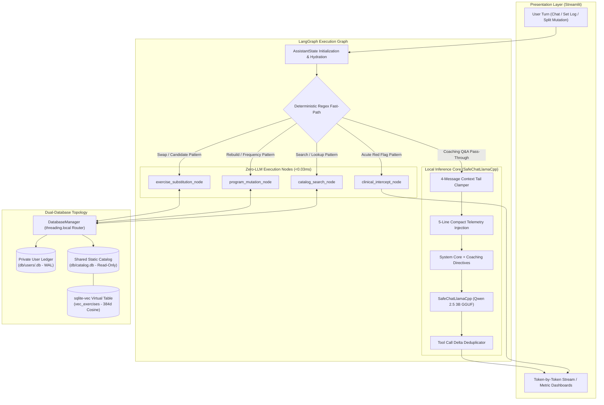
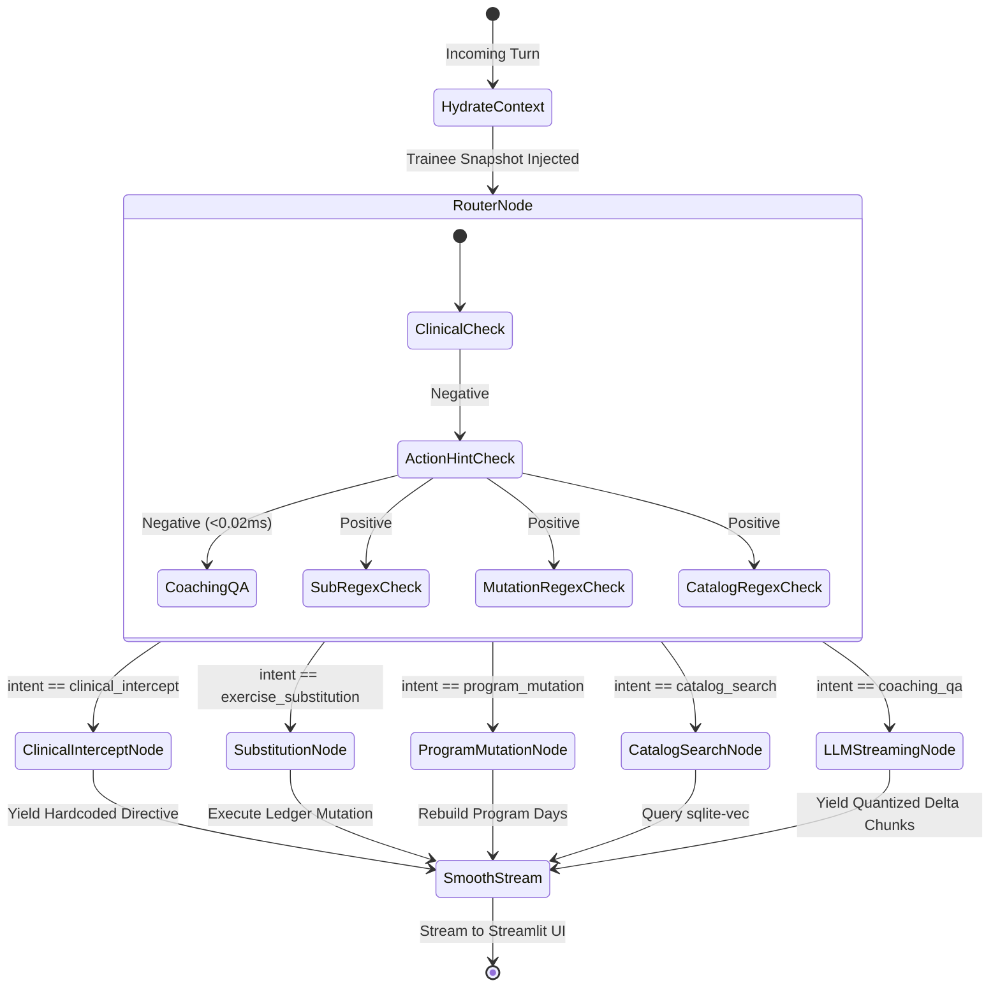
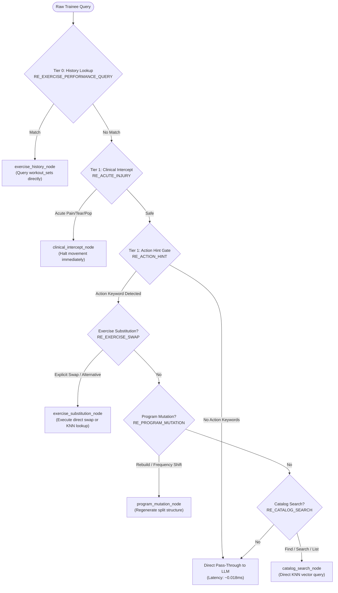
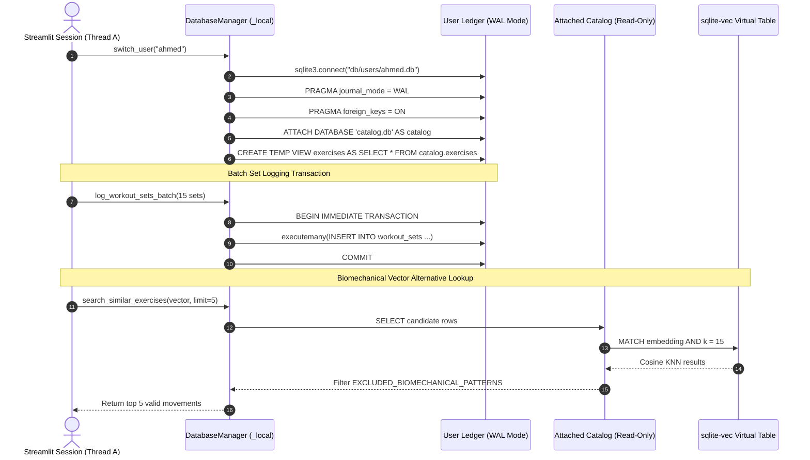
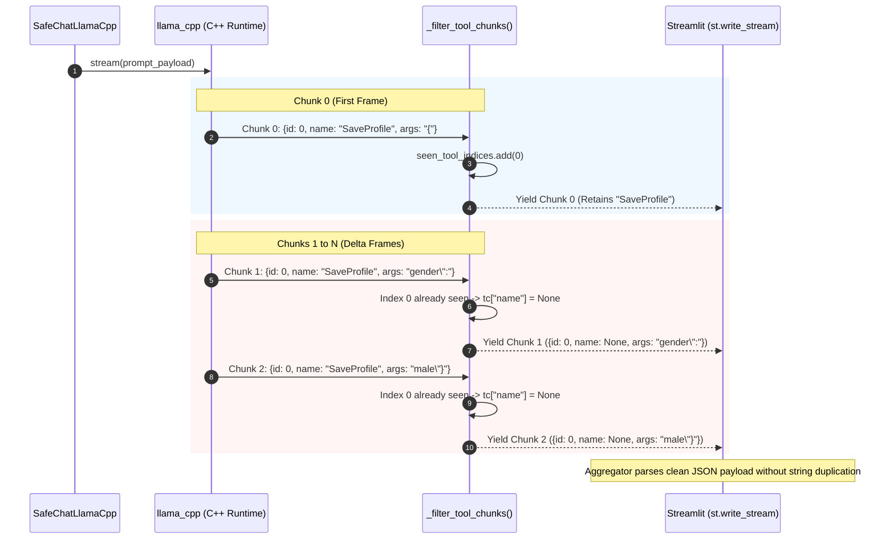
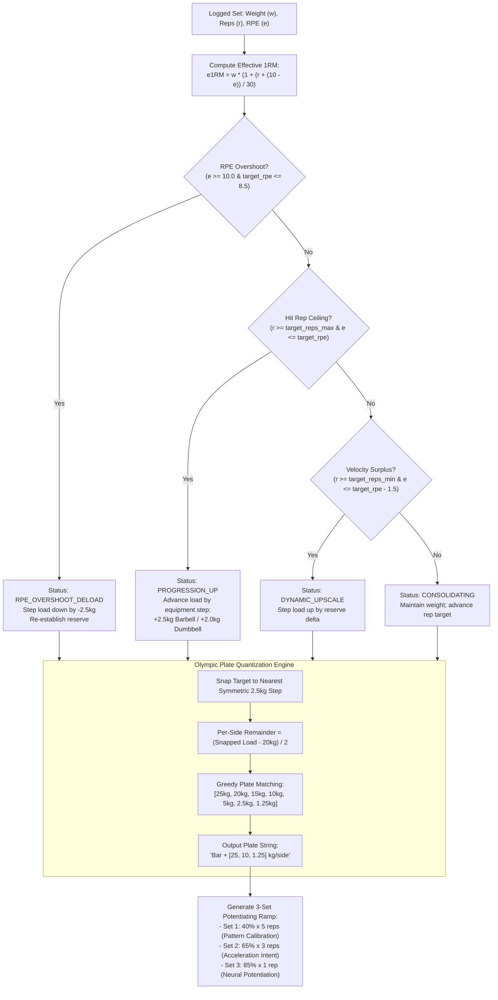
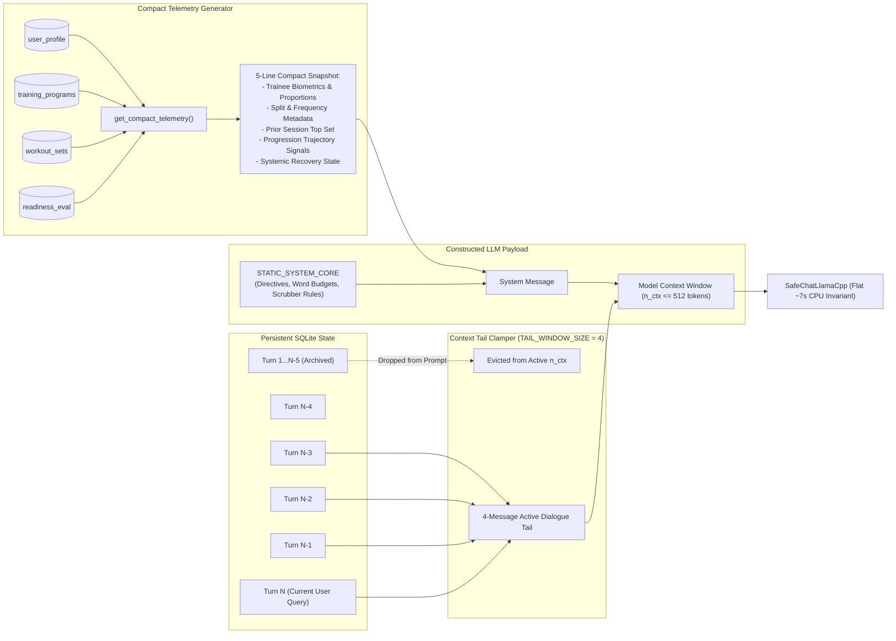

# Myos: System Architecture, LangGraph Workflows & Execution Topologies

This document provides a comprehensive architectural specification of the Myos engine, detailing state graphs, LangChain/LangGraph execution pipelines, sub-millisecond fast-path routing, data flow topologies, and runtime data contracts.

---

## 1. High-Level System Architecture

The following diagram illustrates the lifecycle of a trainee interaction, showing how the Streamlit UI, LangGraph state engine, in-process vector database, and local quantized GGUF runtime interact:



---

## 2. LangGraph State Schema & Data Contracts

The runtime state (`AssistantState`) flows immutably across nodes in `agent/assistant_graph.py`[cite: 1]:

```python
class AssistantState(TypedDict):
    messages: Annotated[List[BaseMessage], add_messages]
    trainee_id: str
    coach_tone: str
    custom_instructions: str
    telemetry_context: str
    intent: Optional[Literal[
        "clinical_intercept",
        "exercise_substitution",
        "program_mutation",
        "catalog_search",
        "coaching_qa"
    ]]
    intent_metadata: Dict[str, Any]
    program_updated: bool
    response_content: Optional[str]
```

### State Node Execution Lifecycle



---

## 3. Deterministic Fast-Path Routing Logic

The fast-path router eliminates LLM classification latency on routine user queries through a multi-tiered hierarchy of compiled regular expressions[cite: 1]:



---

## 4. Dual-Database Topology & Thread-Local Connection Model

Myos combines a static, read-only exercise catalog (`catalog.db`) with dynamic, isolated per-user transaction ledgers (`db/users/<user_id>.db`)[cite: 1]. Cross-tenant leakage is physically impossible, and SQLite Write-Ahead Logging (`WAL`) prevents write contention[cite: 1]:



---

## 5. Token Streaming & Tool-Call Sanitization Flow

To prevent `llama-cpp-python` streaming tool calls from corrupting Pydantic structured output parsers via repeated function name concatenation, `SafeChatLlamaCpp` intercepts the raw C++ chunk stream[cite: 1]:



---

## 6. Biomechanical Auto-Regulation State Machine

During active workout logging in Tab 2, working sets are auto-regulated using RPE-adjusted effective 1RM calculations, Olympic barbell plate quantization, and fatigue thresholds[cite: 1]:



---

## 7. Context Clamping & Telemetry Hydration Pipeline

To maintain flat inference latency and prevent token evaluation degradation across long training histories, Myos replaces full chat serialization with a bounded context pipeline[cite: 1]:

