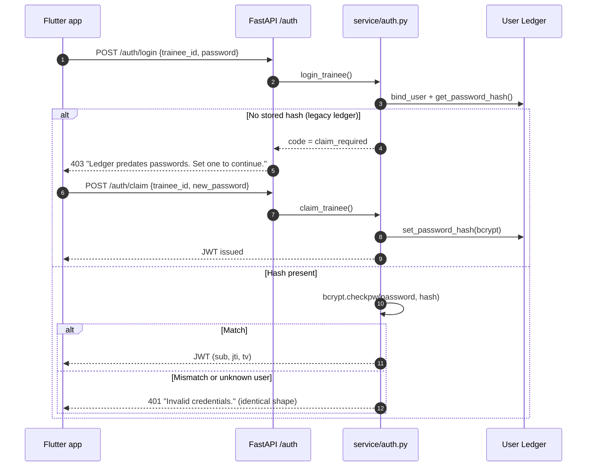
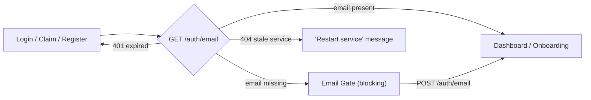
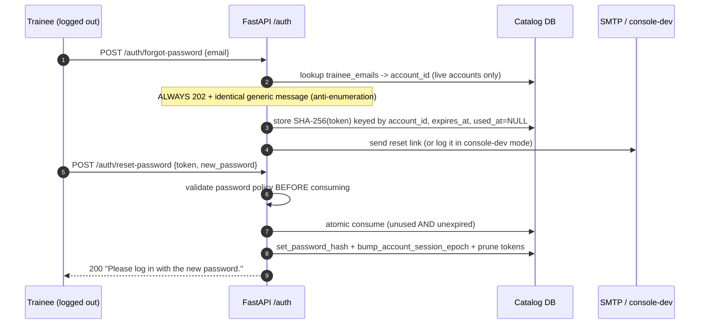

# Myos: Authentication, Session Security & Account Recovery

This document specifies the Myos identity layer: credential storage, JWT session tokens, the revoke-all session-epoch model, recovery email, and the self-service plus operator-driven password recovery flows.

---

## 1. Overview & Threat Model

Myos is a **local-first, single-replica** engine. The identity layer is designed around three realities:

* **No cloud identity provider.** Account identity is an immutable id in the shared catalog registry (`accounts`); each account maps to a per-user SQLite ledger (`db/users/<ledger_id>.db`). There is no external identity provider or directory; email delivery is an optional, self-hosted SMTP backend (Section 9).
* **No account enumeration.** Unknown users and wrong passwords are indistinguishable, and password-recovery requests answer identically whether or not an email is linked.
* **Authentication is separate from inference.** Password hashing and JWT verification do not require a model to be loaded.

The attack surface considered here: credential stuffing (mitigated by strict login rate limits), token replay after theft (mitigated by per-token revocation and the session-epoch model), reset-token interception/replay (mitigated by hashed, single-use, short-TTL tokens), and account enumeration (mitigated by constant-shape responses).

---

## 2. Credential Storage

Credentials are stored per-ledger, never globally:

| Property | Value |
| :--- | :--- |
| Table | `auth_credentials` (one row per ledger, `id = 1`) |
| Columns | `password_hash`, `token_version`, `updated_at` |
| Algorithm | **bcrypt** (`bcrypt.gensalt()` per hash) |
| Password policy | 8–128 characters (`service/auth.py::validate_password`) |
| Plaintext | Never stored, never logged |

Password changes update the ledger credential and advance the account's session epoch in the shared catalog. The catalog also holds immutable ids, status, capabilities, and recovery identity (Section 6).

---

## 3. Registration, Login & the Legacy Claim Flow

`POST /auth/register` creates an immutable account id in the catalog registry, creates the account's ledger, stores the bcrypt hash, and immediately issues a JWT. `POST /auth/login` proves possession of the password and issues a JWT whose subject is that immutable account id.

An enrolled account whose ledger predates schema v2 may have no `auth_credentials` row. It uses a one-time claim flow. A bare local ledger without an account registry entry cannot be claimed through the API (see ADR 015 and the opted-in import in ADR 019):



Claim is **single-use**: once a hash exists, further `/auth/claim` calls return `401 Invalid credentials.`

---

## 4. JWT Session Tokens

Tokens are stateless HS256 JWTs issued by `svc/auth.py`:

| Claim | Meaning |
| :--- | :--- |
| `sub` | **Immutable account id** (never the reusable username) |
| `jti` | Unique token id — the unit of individual revocation |
| `tv` | **Session epoch** from the catalog account registry (Section 5) |
| `iat` / `exp` | Issued-at and expiry; lifetime `JWT_EXPIRY_HOURS` (default **2h**) |

`JWT_SECRET` is mandatory: the service refuses to sign or verify if it is unset (no insecure fallback). Verification (`svc/dependencies.py::get_current_trainee`) enforces, in order:

1. Bearer token present and syntactically valid (`token_claims`: `sub`, `jti`, `tv ≥ 1`).
2. Catalog registry lookup by `sub`: the account must exist, be live (a non-NULL `deleted_at` wins over a stale `status='active'`), and have the player capability. Missing, deleted, or inactive accounts fail closed **before any ledger is mounted**, so a bad token can never create a ledger as a side effect.
3. `tv` equals the account's current registry session epoch.
4. The account's ledger exists, then is mounted to check its token revocation list — identity comes **only** from the verified token, never from request bodies.
5. `jti` not present in the ledger's `revoked_tokens` table.
6. **Worker bind recheck.** Each route calls `bind_request` on the worker thread that will touch SQLite, which re-runs the registry live/capability/epoch check for the same immutable account before mounting. This closes the gap between the request-scoped checks above and the actual ledger work, so a deletion or epoch bump landing in between still fails closed.

Any failure yields a generic `401 Invalid or expired token.` / `Token has been revoked.`

**Backwards compatibility:** legacy tokens whose `sub` is a username are rejected, because only immutable account ids resolve in the registry. Tokens issued before schema v3 carry no `tv` claim and read as version 1 — they remain valid for an enrolled account until the first password event bumps the registry epoch.

---

## 5. Session Invalidation: The Token-Version Epoch (ADR 006)

Per-`jti` revocation (the `revoked_tokens` ledger, written by `POST /auth/logout`) can only kill **known** tokens. A password change must kill **all** sessions — including any held by an attacker — which is inexpressible per-`jti` without a session table. Myos instead uses a single monotonic counter per **account in the catalog registry**, so revocation survives independently of the deletable ledger:

```mermaid
sequenceDiagram
    autonumber
    participant UI as Flutter app
    participant API as FastAPI
    participant SVC as service/auth.py
    participant DB as Catalog Registry

    UI->>API: POST /auth/change-password {current, new} (Bearer tv=1)
    API->>SVC: change_password()
    SVC->>DB: verify current_password (bcrypt, ledger)
    SVC->>DB: set_password_hash(bcrypt(new))
    SVC->>DB: bump_account_session_epoch() -> tv=2
    SVC-->>UI: 200 "All sessions revoked; log in again."
    Note over UI,DB: Every token stamped tv=1 now fails verification step 3 — all devices logged out
```

`bump_account_session_epoch()` is invoked by **every** password event:

| Event | Path |
| :--- | :--- |
| Authenticated change | `POST /auth/change-password` |
| Reset via emailed token | `POST /auth/reset-password` |
| Operator CLI reset | `scripts/reset_password.py` (mandatory registry epoch when enrolled; ledger `token_version` fallback for a bare local ledger) |

Change-password failures return **400, never 401** — so a wrong current password is not misread by clients as session expiry.

---

## 6. Recovery Email and Legacy Client Gate (ADR 007)

Recovery identity lives in the **shared catalog** (`db/catalog.db`), not in per-user ledgers, because the logged-out forgot-password flow cannot know which ledger to open:

| Table | Columns | Purpose |
| :--- | :--- | :--- |
| `trainee_emails` | `trainee_id` (PK, **immutable account id** for live rows), `email` (UNIQUE), `updated_at` | Email ↔ account mapping |
| `password_reset_tokens` | `token_hash` (PK), `trainee_id` (**immutable account id** for live rows), `expires_at`, `used_at`, `created_at` | Single-use reset tokens |

Both tables are provisioned idempotently at catalog boot (`ensure_account_schema()` outside any held lock).

Live recovery rows are keyed by the immutable account id; **legacy username-keyed rows are ignored by lookup**. A stale email mapping or unredeemed token therefore cannot target a new account that reuses a deleted account's username (Section 7).

The legacy Streamlit client gates its dashboard and onboarding on a saved recovery email. The API provides `GET /auth/email` and `POST /auth/email`; it does not enforce that client gate. The Flutter client is the product client under development (ADR 017).



In the legacy client, the sidebar's "Password & Recovery" panel edits the linked email after the gate.

---

## 7. Forgot / Reset Password

Tokens are generated with `secrets.token_urlsafe(32)`; **only the SHA-256 hash is stored**. TTL is `RESET_TOKEN_TTL_MINUTES` (default **30**, clamped 5–120). Consumption is atomic (a conditional `UPDATE … WHERE used_at IS NULL` under the catalog lock), so a token can never be redeemed twice, even concurrently.



Defensive details:

* Weak new passwords are rejected **before** token consumption — a failed attempt does not burn the link.
* Unknown, expired, reused, and fabricated tokens all share one generic `400 Invalid or expired reset code.`
* Expired and consumed tokens are pruned on each request.
* The reset link points at `UI_BASE_URL/?reset_token=…`; the Recover Access tab prefills the code from the query string.

---

## 8. Operator Admin Reset (No-Email Backstop)

When no recovery email exists (or its delivery fails), the operator resets the password directly against the ledger:

```bash
# Interactive (password never touches shell history)
python scripts/reset_password.py <trainee_id>

# Non-interactive (exposed in process list/history — use only for automation)
python scripts/reset_password.py <trainee_id> --password 'new-secret'

# Custom storage locations
python scripts/reset_password.py <trainee_id> \
  --catalog db/catalog.db --users-dir db/users --backups-dir db/backups
```

The CLI validates the password policy, writes a fresh bcrypt hash, and bumps the ledger `token_version`. When the ledger is **enrolled** in the registry it then mandatorily advances the account's registry session epoch — failing loudly rather than reporting success if that cannot be done — so every registry-verified API session is revoked, and it reports the real registry epoch. A bare local ledger with no registry account keeps the legacy behavior and reports its ledger `token_version`. It prunes the revocation ledger and never prints or logs the hash.

---

## 9. Email Delivery

`service/email_sender.py` is deliberately optional at the transport level:

| Configuration | Behavior |
| :--- | :--- |
| `SMTP_HOST` **unset** | **Console-dev backend**: the reset link is written to the service log — safe for local dev, never for shared hosting |
| `SMTP_HOST` set | STARTTLS (default) or implicit TLS (`SMTP_USE_TLS=false`), optional `SMTP_USER`/`SMTP_PASSWORD` auth, 10s timeout |

Delivery failures are logged and swallowed; the client response stays generic. The admin CLI is the guaranteed fallback.

---

## 10. Endpoint & Rate-Limit Reference

| Endpoint | Auth | Limits | Notes |
| :--- | :--- | :--- | :--- |
| `POST /auth/register` | — | 5/min | 409 if ID taken; 201 + JWT |
| `POST /auth/login` | — | 5/min | 401 generic; 403 legacy claim |
| `POST /auth/claim` | — | 5/min | Single-use per ledger |
| `POST /auth/logout` | Bearer | — | Revokes presenting `jti`; 204 |
| `POST /auth/change-password` | Bearer | 10/min | Revokes **all** sessions; 400 on failure |
| `GET /auth/email` | Bearer | — | `{"email": str \| null}` |
| `POST /auth/email` | Bearer | 10/min | Normalizes; 400 on invalid/conflict |
| `POST /auth/forgot-password` | — | 3/hour | Always 202 with generic message |
| `POST /auth/reset-password` | — | 3/hour | Single-use token; bumps epoch |

Rate-limit keys combine the client IP with a bearer-token suffix when present, so authenticated clients do not share a bucket. All limits are overridable via `RATE_LIMIT_*` environment variables.

### Environment Variables

| Variable | Default | Purpose |
| :--- | :--- | :--- |
| `JWT_SECRET` | **required** | HS256 signing/verification key; service refuses to start signing without it |
| `JWT_EXPIRY_HOURS` | `2` | Access-token lifetime |
| `UI_BASE_URL` | `http://localhost:8501` | CORS origin **and** reset-link base |
| `RESET_TOKEN_TTL_MINUTES` | `30` | Clamped to 5–120 |
| `SMTP_HOST` | unset | Unset ⇒ console-dev backend |
| `SMTP_PORT` / `SMTP_USE_TLS` / `SMTP_USER` / `SMTP_PASSWORD` / `SMTP_FROM` | `587` / `true` / — / — / `no-reply@myos.local` | SMTP transport |
| `RATE_LIMIT_LOGIN` / `_REGISTER` / `_PASSWORD` / `_RESET` | `5/min` / `5/min` / `10/min` / `3/hour` | Overrides |

---

## 11. Known Limitations

* **No email ownership verification.** The gate links whatever address the authenticated trainee supplies; a bogus address simply loses self-service recovery (the admin CLI remains the backstop). There is no double opt-in loop.
* **Single-replica rate limiting.** `slowapi` state is in-process; horizontally scaling the service would require a shared store.
* **Console-dev fallback is unsafe on shared hosts.** Leaving `SMTP_HOST` unset logs reset links to `logs/myos.log`; always configure SMTP outside local development.
* **JWT secret rotation** invalidates all sessions globally (all ledgers verify against one `JWT_SECRET`); per-ledger rotation is out of scope.

---

*Related: ADR 006 (token-version session epoch) and ADR 007 (catalog-side recovery identity) in [`DECISIONS.md`](../DECISIONS.md); deployment configuration in [`DEPLOYMENT.md`](DEPLOYMENT.md).*
