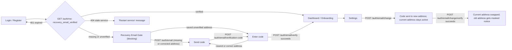
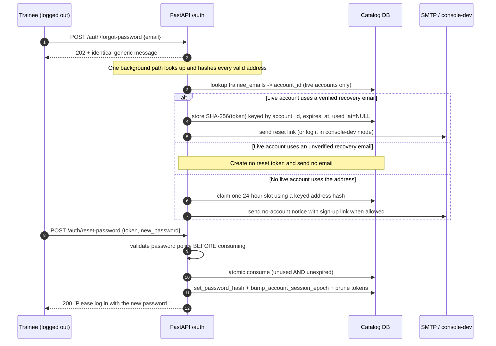

# Myos: Authentication, Session Security & Account Recovery

This document specifies the Myos identity layer: credential storage, JWT session tokens, the revoke-all session-epoch model, recovery email, and the self-service plus operator-driven password recovery flows.

---

## 1. Overview & Threat Model

Myos is a **local-first, single-replica** engine. The identity layer is designed around three realities:

* **No cloud identity provider for account identity.** Account identity is an immutable id in the shared catalog registry (`accounts`); each account maps to a per-user SQLite ledger (`db/users/<ledger_id>.db`). Google is an optional **Linked sign-in** (Section 13): it proves an external subject, it never becomes the account identity, and sign-in or linking never matches by email. On signup, an unused verified Google email may become the new account's recovery email; for an existing account it can verify only a matching unverified recovery email. Email delivery is an optional, self-hosted SMTP backend (Section 9).
* **No account enumeration.** Unknown users and wrong passwords are indistinguishable, and password-recovery requests answer identically whether or not an email is linked.
* **Authentication is separate from inference.** Password hashing and JWT verification do not require a model to be loaded.

The attack surface considered here: credential stuffing (mitigated by strict login rate limits), token replay after theft (mitigated by per-token revocation and the session-epoch model), reset-token interception/replay (mitigated by hashed, single-use, short-TTL tokens), and account enumeration (mitigated by constant-shape responses).

---

## 2. Credential Storage

Credentials are stored per-ledger, never globally:

| Property | Value |
| :--- | :--- |
| Table | `auth_credentials` (one row per ledger, `id = 1`) |
| Columns | `password_hash`, `token_version`, `updated_at` |
| Algorithm | **bcrypt** (`bcrypt.gensalt()` per hash) |
| Password policy | 8–128 characters (`service/auth.py::validate_password`) |
| Plaintext | Never stored, never logged |

Password changes update the ledger credential and advance the account's session epoch in the shared catalog. The catalog also holds immutable ids, status, capabilities, and recovery identity (Section 6).

---

## 3. Registration & Login

`POST /auth/register` creates an immutable account id in the catalog registry, creates the account's ledger, stores the bcrypt hash, and immediately issues a JWT. `POST /auth/login` proves possession of the password and issues a JWT whose subject is that immutable account id.

An owner may issue a **Coach invite** for an existing Account (the default CLI mode and the owner dashboard) or use `scripts/issue_coach_invite.py <username> --new-account` to hold a username for a future Account. The latter stores only the code's SHA-256 hash, defaults to 24 hours, and clamps its lifetime to 5 minutes–7 days. A live Account, existing local ledger, or another live hold makes the username unavailable. Registration without that code returns the same 409 body as an already-taken username. On the sign-up screen, **I have a coach invite code** reveals the optional code field. Registration with the code creates an ordinary Player Account, grants Coach capability, and claims the invite in one catalog transaction; the matching is case-insensitive and uses registration's existing username normalization. Wrong, expired, used, username-mismatched, and account-bound codes share `400 This coach invite code isn't valid for this username` and create no Account. Recovery email is configured in the Flutter app; after registration, a new coach opens in Coach mode on Roster without player intake. A Coach invite grants no Assignment.


---

## 4. JWT Session Tokens

Tokens are stateless HS256 JWTs issued by `svc/auth.py`:

| Claim | Meaning |
| :--- | :--- |
| `sub` | **Immutable account id** (never the reusable username) |
| `jti` | Unique token id — the unit of individual revocation |
| `tv` | **Session epoch** from the catalog account registry (Section 5) |
| `iat` / `exp` | Issued-at and expiry; lifetime `JWT_EXPIRY_HOURS` (default **2h**) |

`JWT_SECRET` is mandatory: the service refuses to sign or verify if it is unset (no insecure fallback). Verification (`svc/dependencies.py::get_current_player`) enforces, in order:

1. Bearer token present and syntactically valid (`token_claims`: `sub`, `jti`, `tv ≥ 1`).
2. Catalog registry lookup by `sub`: the account must exist, be live (a non-NULL `deleted_at` wins over a stale `status='active'`), and have the player capability. Missing, deleted, or inactive accounts fail closed **before any ledger is mounted**, so a bad token can never create a ledger as a side effect.
3. `tv` equals the account's current registry session epoch.
4. The account's ledger exists, then is mounted to check its token revocation list — identity comes **only** from the verified token, never from request bodies.
5. `jti` not present in the ledger's `revoked_tokens` table.
6. **Worker bind recheck.** Each route calls `bind_request` on the worker thread that will touch SQLite, which re-runs the registry live/capability/epoch check for the same immutable account before mounting. This closes the gap between the request-scoped checks above and the actual ledger work, so a deletion or epoch bump landing in between still fails closed.

Any failure yields a generic `401 Invalid or expired token.` / `Token has been revoked.`

**Backwards compatibility:** legacy tokens whose `sub` is a username are rejected, because only immutable account ids resolve in the registry. Tokens issued before schema v3 carry no `tv` claim and read as version 1 — they remain valid for an enrolled account until the first password event bumps the registry epoch.

---

## 5. Session Invalidation: The Token-Version Epoch (ADR 006)

Per-`jti` revocation (the `revoked_tokens` ledger, written by `POST /auth/logout`) can only kill **known** tokens. A password change must kill **all** sessions — including any held by an attacker — which is inexpressible per-`jti` without a session table. Myos instead uses a single monotonic counter per **account in the catalog registry**, so revocation survives independently of the deletable ledger:

```mermaid
sequenceDiagram
    autonumber
    participant UI as Flutter app
    participant API as FastAPI
    participant SVC as service/auth.py
    participant DB as Catalog Registry

    UI->>API: POST /auth/change-password {current, new} (Bearer tv=1)
    API->>SVC: change_password()
    SVC->>DB: verify current_password (bcrypt, ledger)
    SVC->>DB: set_password_hash(bcrypt(new))
    SVC->>DB: bump_account_session_epoch() -> tv=2
    SVC-->>UI: 200 "All sessions revoked; log in again."
    Note over UI,DB: Every token stamped tv=1 now fails verification step 3 — all devices logged out
```

`bump_account_session_epoch()` is invoked by **every** password *change*:

| Event | Path |
| :--- | :--- |
| Authenticated change | `POST /auth/change-password` |
| Reset via emailed token | `POST /auth/reset-password` |
| Operator CLI reset | `scripts/reset_password.py` (mandatory registry epoch when enrolled; ledger `token_version` fallback for a bare local ledger) |

Change-password failures return **400, never 401** — so a wrong current password is not misread by clients as session expiry.

**What does not bump the epoch (#114).** Connecting a Linked sign-in (`POST /auth/google/link`), disconnecting it (`DELETE /auth/google/link`), and setting an account's **first** password (`POST /auth/set-password`) add or remove a *way to sign in*, not a credential that is being replaced, so they leave every existing session valid. Changing an existing password — through `POST /auth/change-password` or an emailed reset — still revokes all sessions as above.

---

## 6. Verified Recovery Email Gate (ADR 007)

Recovery identity lives in the **shared catalog** (`db/catalog.db`), not in per-user ledgers, because the logged-out forgot-password flow cannot know which ledger to open:

| Table | Columns | Purpose |
| :--- | :--- | :--- |
| `trainee_emails` | `trainee_id` (PK, **immutable account id** for live rows), `email` (UNIQUE), `updated_at`, `verified` | Current recovery address and verification state |
| `pending_recovery_emails` | `account_id` (PK), `email`, `updated_at` | Address awaiting verification for a Settings change; multiple accounts may stage the same address |
| `password_reset_tokens` | `token_hash` (PK), `trainee_id` (**immutable account id** for live rows), `expires_at`, `used_at`, `created_at` | Single-use reset tokens |
| `email_verification_codes` | `code_id`, keyed `code_hash`, `account_id`, keyed `address_hash`, `purpose`, `expires_at`, `used_at`, `failed_attempts`, `created_at` | Short-lived address-verification codes; no address or raw code |

These tables are provisioned idempotently at catalog boot (`ensure_account_schema()` outside any held lock). The additive migration gives existing recovery addresses `verified=0`.

Live recovery rows are keyed by the immutable account id; **legacy username-keyed rows are ignored by lookup**. A stale email mapping or unredeemed token therefore cannot target a new account that reuses a deleted account's username (Section 7).

`GET /auth/me` includes `recovery_email_verified`, which the Flutter router uses to gate dashboard, Coach mode, and onboarding. The API also provides `GET /auth/email`, `POST /auth/email`, `POST /auth/email/verification-code`, and `POST /auth/email/verify`. The blocking app gate accepts or corrects an address, sends a code, and remains closed until verification succeeds. Existing saved addresses start unverified and reach code entry on the next authenticated session.

Settings changes use `POST /auth/email/change` to stage a new address and send a code to it, then `POST /auth/email/change/verify` to confirm the code. Until confirmation, the pending address is unused and the current verified address remains the recovery address. The swap and pending-row removal are atomic; a request for another change replaces the prior pending address and code. A pending address is not reserved, so separate accounts may stage the same address; the first successful verification links it, and later attempts fail generically. After a successful swap, the old address receives a notice in the account's Display language that shows the new address only masked.

Verification codes are six digits, expire after `EMAIL_VERIFICATION_CODE_TTL_MINUTES` (default 10, clamped 5–60), and are stored only as a purpose-separated keyed hash bound to the immutable account id and keyed address hash. Each code allows at most five failed attempts; each account and purpose may issue at most five codes per rolling hour. Both limits are enforced in catalog transactions. Sending a replacement invalidates previous unused codes. The send endpoint uses the reset rate limit, while verify uses the password rate limit (10/minute); all wrong, expired, used, and unknown codes return the same generic 400. Code emails use the account's Display language and the shared email sender. Its console-dev backend prints the code for local development; configured mail backends and ordinary logs do not.


```mermaid
flowchart LR
    Login["Login / Register"] --> Check{"GET /auth/me: recovery_email_verified"}
    Check -- "verified" --> Dashboard["Dashboard / Onboarding"]
    Check -- "missing or unverified" --> Gate["Recovery Email Gate (blocking)"]
    Gate -- "POST /auth/email (missing or corrected address)" --> Send["Send code"]
    Gate -- "saved unverified address" --> Verify["Enter code"]
    Send -- "POST /auth/email/verification-code" --> Verify["Enter code"]
    Verify -- "POST /auth/email/verify succeeds" --> Dashboard
    Verify -- "resend or correct address" --> Send
    Dashboard --> Settings["Settings"]
    Settings -- "POST /auth/email/change" --> ChangeCode["Code sent to new address; current address stays active"]
    ChangeCode -- "POST /auth/email/change/verify succeeds" --> Changed["Current address swapped; old address gets masked notice"]
    Check -- "401 expired" --> Login
    Check -- "404 stale service" --> Ops["'Restart service' message"]
```

---

## 7. Forgot / Reset Password

Tokens are generated with `secrets.token_urlsafe(32)`; **only the SHA-256 hash is stored**. TTL is `RESET_TOKEN_TTL_MINUTES` (default **30**, clamped 5–120). Consumption is atomic (a conditional `UPDATE … WHERE used_at IS NULL` under the catalog lock), so a token can never be redeemed twice, even concurrently.


```mermaid
sequenceDiagram
    autonumber
    participant User as Trainee (logged out)
    participant API as FastAPI /auth
    participant DB as Catalog DB
    participant Mail as SMTP / console-dev

    User->>API: POST /auth/forgot-password {email}
    API-->>User: 202 + identical generic message
    Note over API: One background path looks up and hashes every valid address
    API->>DB: lookup trainee_emails -> account_id (live accounts only)
    alt Live account uses a verified recovery email
    API->>DB: store SHA-256(token) keyed by account_id, expires_at, used_at=NULL
    API->>Mail: send reset link (or log it in console-dev mode)
    else Live account uses an unverified recovery email
    Note over API,DB: Create no reset token and send no email
    else No live account uses the address
    API->>DB: claim one 24-hour slot using a keyed address hash
    API->>Mail: send no-account notice with sign-up link when allowed
    end
    User->>API: POST /auth/reset-password {token, new_password}
    API->>API: validate password policy BEFORE consuming
    API->>DB: atomic consume (unused AND unexpired)
    API->>DB: set_password_hash + bump_account_session_epoch + prune tokens
    API-->>User: 200 "Please log in with the new password."
```

Defensive details:

* A well-formed address that has no live MAYOS account receives a short **“No MAYOS account uses this email”** email with a sign-up link and advice to try the registered address or add a recovery email in Settings. The link uses `RESET_LINK_BASE_URL/register`, the same host as reset links. When no web origin is configured, the API serves a self-contained page asking the person to open the MAYOS app. Malformed addresses send no email. Unknown-address notices share the SMTP/console sender and are limited to one per address every 24 hours using a keyed hash. Expired hashes are pruned during forgot-password requests; no startup or scheduled cleanup exists, so inactive rows can remain until another request. The address itself is never stored for this limit.
* A reset link is created and sent only when a live account's recovery email is verified. An unverified address receives no email and gets no reset token. The unknown-address notice behavior remains unchanged.
* The forgot-password endpoint returns its usual generic 202 before lookup or email work begins. FastAPI `BackgroundTasks` then runs one service task with the catalog store passed explicitly; that task performs account lookup and cleanup after the response has been sent. It creates and sends a reset only after confirming the recovery email is verified. Verified, unverified, and unknown addresses share the same response shape and `3/hour` rate limit. The app keeps the generic success message because email work can reach someone other than the person using the device; a different on-screen response would reveal which case applied.
* Weak new passwords are rejected **before** token consumption — a failed attempt does not burn the link.
* Unknown, expired, reused, and fabricated tokens all share one generic `400 Invalid or expired reset code.`
* Expired and consumed tokens are pruned on each request.
* The reset link is `RESET_LINK_BASE_URL/reset-password?token=…`. An unset `RESET_LINK_BASE_URL` defaults to the API's own local base (`http://localhost:8000`) for development only. The path is an **Android App Link** when the app is installed and a **hosted fallback page** otherwise. In production the host must be identical in all three places: `RESET_LINK_BASE_URL`, the Android App Link intent-filter host (`-PappLinkHost`), and where `/.well-known/assetlinks.json` is served.
  * `GET /reset-password` on the API serves a self-contained HTML page (strict nonce CSP, `Referrer-Policy: no-referrer`, `Cache-Control: no-store`) that reads the token from `location`, immediately scrubs it from the URL with `history.replaceState(null, '', location.pathname)`, and POSTs to `/auth/reset-password`; the token is never reflected into the HTML. A non-string error body (for example a 422 validation list) falls back to the generic message.
  * `GET /.well-known/assetlinks.json` serves the Digital Asset Links statement (`ANDROID_APP_PACKAGE`, `ANDROID_APP_SHA256_CERT_FINGERPRINTS`). Each fingerprint may use upper/lower case and colons or not; it is normalised to the uppercase colon-separated 32-byte form, invalid entries are skipped with a logged warning, and no valid fingerprint returns 404 rather than an invalid file.
  * The API installs an `uvicorn.access` log filter (`svc/app.py::RedactResetTokenFilter`) that rewrites any `token=…` query value to `token=[REDACTED]`, so the single-use token never lands in access logs regardless of the uvicorn CLI flags.
* A **Google-only account** uses this flow unchanged (#114): it sets a recovery email with `POST /auth/email`, redeems the emailed token, and gets its first password. The Linked sign-in is untouched, so afterwards the account can sign in with either method (and may then disconnect Google).

---

## 8. Owner-Initiated Resets

The owner dashboard can send the standard reset email when a recovery email is linked and verified. If the address is absent or unverified, it can issue a single-use reset link with a separate `ADMIN_RESET_LINK_TTL_MINUTES` lifetime (default **1440**, clamped 5–10080 minutes); the raw link is shown once. An unverified email attempt is audited without the address. Redeeming either reset changes the password through the existing reset flow and advances the account session epoch, ending every session.

For a direct password set, the operator uses the CLI against the ledger:

```bash
# Interactive (password never touches shell history)
python scripts/reset_password.py <trainee_id>

# Non-interactive (exposed in process list/history — use only for automation)
python scripts/reset_password.py <trainee_id> --password 'new-secret'

# Custom storage locations
python scripts/reset_password.py <trainee_id> \
  --catalog db/catalog.db --users-dir db/users --backups-dir db/backups
```

The CLI validates the password policy, writes a fresh bcrypt hash, and bumps the ledger `token_version`. When the ledger is **enrolled** in the registry it then mandatorily advances the account's registry session epoch — failing loudly rather than reporting success if that cannot be done — so every registry-verified API session is revoked, and it reports the real registry epoch. A supplied ledger id that belongs to a live account resolves that account and revokes its sessions too. A bare local ledger with no registry account keeps the legacy behavior and reports its ledger `token_version`. It prunes the revocation ledger and never prints or logs the hash. Each owner-initiated email, reset-link, or CLI password-set operation is recorded in the shared audit log; entries omit email addresses, links, tokens, and passwords.

### Owner-initiated deletion

From a live account page, the owner can open `GET /admin/accounts/{account_id}/delete` and submit `POST /admin/accounts/{account_id}/delete`. Both require a valid owner session; the POST also requires CSRF. Confirmation requires typing the exact username, entering a fresh replay-protected TOTP code even within that session, and providing a non-empty reason of at most 500 characters. Reasons containing email addresses or links are rejected. Failed confirmations are audited without storing the submitted reason.

Deletion is immediate and final. The service captures the recovery email, writes the ADR 039 durable deletion record, attempts the customer notice, then runs `DatabaseManager.delete_account` to invalidate sessions and remove the ledger and account-specific backups. The same ADR 039 cleanup applies to a coach, including ending active assignments; the confirmation shows the active-player count for a coach. A failed notice does not stop deletion and creates an `account_deleted_email_failed` audit event. The `account_deleted` audit event records the owner, account id, available source IP, and reason. Deleted accounts have no owner deletion action, and both deletion routes return 404 for them. The username can be registered again only under a new immutable account id and ledger.

---

## 9. Email Delivery

`service/email_sender.py` is deliberately optional at the transport level:

| Configuration | Behavior |
| :--- | :--- |
| `SMTP_HOST` **unset** | **Console-dev backend**: the reset link is written to the service log — safe for local dev, never for shared hosting |
| `SMTP_HOST` set | STARTTLS (default) or implicit TLS (`SMTP_USE_TLS=false`), optional `SMTP_USER`/`SMTP_PASSWORD` auth, 10s timeout |

Delivery failures are logged and swallowed; the client response stays generic. Transport failure logs contain the delivery purpose, SMTP error class/code, and either the immutable account id or a keyed recipient reference; they omit the address and exception text. Preparation failures log the purpose, account id when known, and exception traceback without the address. Recipient references use a key derived from `JWT_SECRET`, so rotating that secret changes the references. Without `JWT_SECRET` (development only), references are keyed per process. The console backend redacts the email address while keeping the reset link printable. The admin CLI is the guaranteed fallback.

---

## 10. Endpoint & Rate-Limit Reference

| Endpoint | Auth | Limits | Notes |
| :--- | :--- | :--- | :--- |
| `POST /auth/register` | — | 5/min | Optional `coach_invite_code` and `display_language` (`en`/`ar`, default `en`); 409 if username taken or held (identical response); 400 generic invalid Coach invite; 201 + JWT |
| `POST /auth/login` | — | 5/min | 401 generic for unknown usernames and invalid passwords |
| `POST /auth/google` | — | 5/min | Verifies a Google ID token: linked subject ⇒ `TokenOut` (remember-me lifetime), otherwise `{signup_ticket, suggested_username, existing_account_hint}`; the hint is true only for a verified-email match to a live recovery email; 503 when `GOOGLE_WEB_CLIENT_ID` is unset |
| `GET /auth/username-available` | signup ticket (Bearer) | 30/min | `{available, reason?}`; clear 400 for a username that breaks the rule; 401 for a missing/expired ticket |
| `POST /auth/google/complete` | — | 5/min | Re-verifies the signup ID token against the ticket subject; one catalog transaction for account + link + eligible verified recovery email; accepts `display_language` (`en`/`ar`, default `en`); 400 invalid username, 409 taken or already linked |
| `POST /auth/google/link` | Bearer | 10/min | Connects a verified Google identity to the caller; idempotent; 409 conflicts (never which other account); 503 when `GOOGLE_WEB_CLIENT_ID` is unset |
| `DELETE /auth/google/link` | Bearer | 10/min | Disconnects Google; **409 unless the account has a password** (an account always keeps one way to sign in); idempotent; 503 when unconfigured |
| `POST /auth/set-password` | Bearer | 10/min | First password only (e.g. a Google-only account); 409 pointing at `change-password` when one exists; no epoch bump |
| `GET /auth/me` | Bearer | — | Identity, capabilities, plans, `display_language`, plus `has_password` and `linked_sign_ins` (provider names only, never a subject) |
| `PUT /auth/display-language` | Bearer | — | Saves `display_language` (`en` or `ar`) against the immutable account id |
| `POST /auth/logout` | Bearer | — | Revokes presenting `jti`; 204 |
| `POST /auth/change-password` | Bearer | 10/min | Revokes **all** sessions; 400 on failure |
| `DELETE /auth/account` | Bearer | 10/min | Exactly one proof: `password` **or** a fresh `google_id_token` (ADR 039); 400 generic on any failure |
| `GET|POST /admin/accounts/{account_id}/delete` | Owner session | — | Owner-initiated ADR 039 deletion; POST requires CSRF, exact username, fresh TOTP, and a reason |
| `GET /auth/email` | Bearer | — | `{"email": str \| null}` |
| `POST /auth/email` | Bearer | 10/min | Normalizes; 400 on invalid/conflict |
| `POST /auth/forgot-password` | — | 3/hour | Always 202 with generic message |
| `POST /auth/reset-password` | — | 3/hour | Single-use token; bumps epoch |
| `GET /reset-password` | — | — | Hosted fallback reset page (no-store, no-referrer, strict CSP) |
| `GET /.well-known/assetlinks.json` | — | — | Android App Link statement; 404 when no fingerprint configured |

Rate-limit keys combine the client IP with a bearer-token suffix when present, so authenticated clients do not share a bucket. All limits are overridable via `RATE_LIMIT_*` environment variables.

### Environment Variables

| Variable | Default | Purpose |
| :--- | :--- | :--- |
| `JWT_SECRET` | **required** | HS256 signing/verification key; service refuses to start signing without it |
| `JWT_EXPIRY_HOURS` | `2` | Access-token lifetime |
| `GOOGLE_WEB_CLIENT_ID` | unset (⇒ `/auth/google*` returns 503) | The **only** audience Google ID tokens are verified against (Section 13); the same value the Android client passes as `serverClientId` |
| `UI_BASE_URL` | `http://localhost:7357` | CORS origin(s), comma-separated; when set, the first origin is the `GET /register` web target (not used for reset links) |
| `RESET_LINK_BASE_URL` | `http://localhost:8000` | Reset-link / App Link base (`<base>/reset-password?token=…`) |
| `ANDROID_APP_PACKAGE` | `com.mayos.mayos_mobile` | Package name in `assetlinks.json` |
| `ANDROID_APP_SHA256_CERT_FINGERPRINTS` | unset (⇒ 404) | Comma-separated signing-cert SHA-256 fingerprints (case/colons optional; normalised) |
| `RESET_TOKEN_TTL_MINUTES` | `30` | Clamped to 5–120 |
| `SMTP_HOST` | unset | Unset ⇒ console-dev backend |
| `SMTP_PORT` / `SMTP_USE_TLS` / `SMTP_USER` / `SMTP_PASSWORD` / `SMTP_FROM` | `587` / `true` / — / — / `no-reply@myos.local` | SMTP transport |
| `RATE_LIMIT_LOGIN` / `_REGISTER` / `_PASSWORD` / `_RESET` | `5/min` / `5/min` / `10/min` / `3/hour` | Overrides |
| `RATE_LIMIT_USERNAME_CHECK` | `30/min` | `GET /auth/username-available` — roomier than login because the picker asks as you type |
| `MAYOS_DELETIONS_DB` | `<catalog dir>/deletions.db` | Durable deletion-record store, kept **outside** catalog snapshots (ADR 039) |

---

## 11. Known Limitations

* **No email ownership verification.** The gate links whatever address the authenticated trainee supplies; a bogus address simply loses self-service recovery (the admin CLI remains the backstop). There is no double opt-in loop.
* **Single-replica rate limiting.** `slowapi` state is in-process; horizontally scaling the service would require a shared store.
* **Console-dev fallback is unsafe on shared hosts.** Leaving `SMTP_HOST` unset logs reset links to `logs/myos.log`; always configure SMTP outside local development.
* **JWT secret rotation** invalidates all sessions globally (all ledgers verify against one `JWT_SECRET`); per-ledger rotation is out of scope.

---

## 12. Durable Account Deletion (ADR 015/039)

An account holder deletes their account with `DELETE /auth/account` carrying **exactly one** proof (rate-limited with the password limit): `{"password": "..."}`, or `{"google_id_token": "..."}` for an account that signs in with a Linked sign-in (#114). The Google proof must be an ID token that passes the same verification sign-in uses **and** whose `sub` is linked to the caller **and** whose `iat` is within the last **5 minutes** — a stale, wrong-sub, or unverifiable token returns the very same generic `400 Invalid credentials.` as a wrong password, so the endpoint reveals nothing about the link. A wrong password likewise returns that generic 400 and changes nothing. On success every session is dead and the account's active data is gone. The full decision and per-table breakdown are ADR 039; the operator-facing recovery details are in [`DEPLOYMENT.md`](DEPLOYMENT.md).

When the deleted account is a Coach, Coach exercise ids, names, and body-part/equipment tags remain so players' retained programs and workout history keep resolving. Coach-authored notes and video links are cleared with the catalog cleanup (ADR 064).

```mermaid
sequenceDiagram
    autonumber
    participant App as Flutter app
    participant API as FastAPI /auth
    participant DB as Catalog
    participant DEL as deletions.db
    participant FS as Users / backups

    App->>API: DELETE /auth/account {password | google_id_token} (Bearer)
    alt password proof
        API->>DB: verify password (bcrypt, ledger)
    else google proof
        API->>API: verify id_token; sub must be linked to caller; iat ≤ 5 min
    end
    API->>DEL: (a) write durable deletion record FIRST
    API->>DB: (b) one transaction: status='deleted', deleted_at, session_epoch+1, clear recovery/invites/coach profile, linked_sign_ins, end assignments, delete relationships
    API->>FS: (c) close conn, remove ledger (.db/-wal/-shm) + backups/<ledger>/
    API-->>App: 200 "Account deleted. All sessions have been ended."
    Note over DEL,DB: Any later startup/restore replays the record, so an old token or a restored catalog snapshot cannot resurrect the identity
```

Key properties:

* **Revoke-all + fail closed.** The catalog transaction bumps `session_epoch`, so every bearer and remember-me token fails verification (Section 4/5). The partially-deleted account also fails closed because `deleted_at` is authoritative (a non-NULL `deleted_at` wins over a stale `status='active'`).
* **The link dies with the account (#114).** The `linked_sign_ins` rows are deleted **inside the same catalog transaction** as the account row, so the Google subject is freed for a later brand-new MAYOS account and a username that is reused afterwards inherits nothing. Deletion replay (`replay_deletions`/`reapply_deletions`) runs the same transaction, so a restored snapshot that brings a link row back loses it again on the next pass.
* **Crash-safe and resumable, never rolled back.** The durable record is written before any catalog change and carries an `applied_at` marker. Service startup and the hourly sweep run an incremental replay that completes only not-yet-applied records (so an interrupted deletion resolves without a restart); the restore path runs the full replay (`scripts/reapply_deletions.py`) which re-checks every record. `deletions.db` is kept **outside** the catalog/ledger backup archive, backed up separately and append-only, and is never restored over a newer copy — so a restore cannot undo a deletion. A replayed record never removes a ledger that a reused username's **new** account owns.
* **Username reuse only as a new account.** The partial unique username index (`WHERE deleted_at IS NULL`) frees the name; registering it again creates a new immutable `account_id` with an empty ledger, and the old `sub` still resolves to the deleted id, never the new account. A reused username also gets a **distinct `ledger_id`/ledger path** (`<username>-<account_id[:12]>`), so replaying the old deletion record can never remove the new account's ledger.
* **Deletion signal for other devices.** An authenticated request whose token signature verifies but whose subject is deleted returns `401 {"error": "account_deleted"}` (distinct from the ordinary `{"detail": ...}` 401 for expiry/revocation). The Flutter client uses it to erase that account's protected local data — drafts, cached program/prescriptions, cached chat history, and disclosure acceptance — without the logout keep/discard prompt, then clears the session. An ordinary 401 keeps the normal logout behavior.

### Information disclosure

`account_deleted` is disclosed only to a caller holding a **validly signed token** for that account: the JWT signature and required claims are verified before the registry records are consulted, so an attacker who has not obtained the token learns nothing, and an unknown account still returns the generic `401 Invalid or expired token.`

---

## 13. Google Linked Sign-in (issues #113 / #114)

A **Linked sign-in** ([`CONTEXT.md`](../CONTEXT.md)) attaches an external identity to exactly one account. The link is keyed on `(provider, subject)` — `('google', <Google sub>)` — and stored in the shared catalog table `linked_sign_ins (provider, subject, account_id, linked_at)` with `UNIQUE(provider, subject)`, `UNIQUE(account_id, provider)` (an account holds at most one link per provider; added as an index by `SchemaMixin._ensure_linked_sign_in_account_provider` on catalogs created before it), and an index on `account_id`. It lives in the catalog, never in a player's ledger, because the flow runs logged out. Sign-in and linking are **never matched by email**. For an unlinked subject, a verified email that matches a live recovery email sets the existing boolean signup hint; on a completed new signup, an unused verified email may be saved only as that account's recovery email. A live-account match keeps Google's email out of the separate account. On an existing account, Google can verify only the current unverified recovery email when the addresses match; it does not replace a different email. These rules do not link or merge accounts by email or reveal a username. Google names and pictures are not stored either, and `provider` is data, so another provider needs no schema change.

**Configuration.** `GOOGLE_WEB_CLIENT_ID` is read **by name only** — never hard-coded, never logged — and is the single audience for verification. Android obtains its ID token for the web client ID passed as `serverClientId`, and the web client uses the same ID, so one web client ID covers both clients and no Android-specific audience is needed. While the variable is unset, every `/auth/google*` endpoint — sign-in, the picker, completion, connect, and disconnect — answers `503` and nothing else in the service changes (`svc/dependencies.py::google_sign_in_enabled` is the single place that decides this).

```mermaid
sequenceDiagram
    autonumber
    participant App as Flutter app
    participant API as FastAPI /auth/google*
    participant G as Google ID-token verifier
    participant DB as Catalog (accounts, linked_sign_ins, trainee_emails)

    App->>API: POST /auth/google {id_token}
    API->>G: verify_oauth2_token(token, requests.Request(), audience=GOOGLE_WEB_CLIENT_ID)
    alt (google, sub) linked to a live account
        API-->>App: TokenOut (always the remember-me lifetime)
    else new subject
        opt email is present and email_verified is true
            API->>DB: Compare normalized email with recovery-email store
            DB-->>API: Live account match or no match
        end
        API-->>App: {signup_ticket (15 min), suggested_username, existing_account_hint}
        opt existing_account_hint is true
            App-->>App: Show login nudge; offer separate-account picker
        end
        Note over App: Nothing is written; abandoning here leaves nothing behind.
        App->>API: GET /auth/username-available?username=… (Bearer: signup ticket)
        API-->>App: {available, reason?}
        App->>API: POST /auth/google/complete {signup_ticket, username, id_token}
        API->>G: Re-verify token and require its subject to match the ticket
        API->>DB: ONE transaction: account + link + eligible verified recovery email
        API-->>App: TokenOut
    end
```

**Verifier seam.** Production verification is `google.oauth2.id_token.verify_oauth2_token(token, request, audience=GOOGLE_WEB_CLIENT_ID, clock_skew_in_seconds=10)` (`google-auth`), which checks the signature, the audience, `exp`/`iat` (with a small clock skew so a few seconds of drift do not refuse a fresh token), and the issuer; our own issuer/`sub` checks repeat those contracts explicitly. Verification runs on **one cached google-auth `Request` built over a module-level `requests.Session`**, so every sign-in shares a single pooled transport instead of building a new one (cachecontrol is not a dependency of this project, so no HTTP-level response cache sits on top). Every rejection — wrong audience or issuer included — collapses into one generic `401 Invalid Google credentials.` The seam (`svc/dependencies.py::get_google_verifier`) returns `sub` and `iat`, plus `given_name` to seed the username *suggestion*. It also carries `email` and the exact boolean `email_verified` in memory. For first signup, the app holds the ID token only in memory and sends it again at completion; the server verifies that token and its subject before it can save an unused verified email as the new recovery email. The email is never put in the signup ticket, response, logs, or Audit log. These fields are injected like the other app-owned dependencies, so tests substitute a fake and never reach the network. `svc/dependencies.py::google_sign_in_enabled` is the **single** place that answers `503` for an unconfigured `GOOGLE_WEB_CLIENT_ID`; the seam itself fails closed rather than raising a second, competing 503.

**First sign-in.** An unknown subject gets `{signup_ticket, suggested_username, existing_account_hint}`; no account, link, or profile row exists yet, so abandoning the flow leaves nothing behind. The hint is true only when the token contains a valid email with `email_verified: true` and its normalized value matches a recovery email in `trainee_emails` for a live account. Missing, unverified, malformed, unmatched, or deleted-account emails produce `false`. The ticket contains the subject and, only for a match, a signed boolean conflict marker; it never contains the email or name. The response never identifies the matched account. The Flutter app replaces the picker with “You already have a MAYOS account for this email. Log in with your password, then connect Google in Settings.” **Log in** clears Google SDK state and returns to login. **Create a separate account anyway** continues to the same username picker; leaving it still creates nothing and clears Google SDK state.

* The **signup ticket** is a 15-minute HS256 JWT signed with `JWT_SECRET` and carrying `type=google_signup` and `aud=mayos:google-signup`, plus the subject and optional boolean recovery-email conflict marker — never an email or name. Decoding **requires** `exp`, `aud` and `sub` (`options={"require": [...]}`), so a ticket with its lifetime stripped never validates. It is refused as a session token in both directions: `token_claims` rejects any token carrying `type`/`aud` (and PyJWT rejects an `aud` claim when no audience is expected) and a session token fails the ticket's audience/`type` check, so a ticket can never be replayed as a bearer token. For `GET /auth/username-available` the ticket travels in the `Authorization: Bearer` header — never in the query string — so it cannot land in access logs.
* `suggested_username` comes from the token's given name: lowercased, characters outside `a–z 0–9 _ -` dropped, 3–30 characters, a numeric suffix when the base is taken (a missing or unusable given name falls back to `player`). It is checked for availability and **never stored** — only the username the person keeps becomes the account's.
* `GET /auth/username-available?username=…` answers `{available, reason?}` (`reason` is `"taken"`). The same rule the completion enforces applies here: a username outside `3–30 × a–z 0–9 _ -` after lowercasing is a clear `400`, never a silent rewrite.
* `POST /auth/google/complete {signup_ticket, username, id_token}` validates the picked username and re-verifies the ID token, requiring its subject to match the ticket. The current app always sends the token; compatibility clients may omit it, but then no Google email is stored and the normal recovery-email gate applies. In **one catalog transaction** it creates the account exactly as `register_player` does (player capability, its own ledger, no password hash), inserts the link, and saves the verified email as the recovery email only when it was not matched at signup and remains unused. A ticket with the conflict marker, a current recovery-email owner, or an email that is missing, malformed, or not verified gets no Google email stored and uses the normal recovery-email gate. A taken username returns `409`; if the same subject is linked concurrently, the `UNIQUE(provider, subject)` constraint aborts the transaction so the losing request creates no second account. Success returns `TokenOut`, again with the remember-me lifetime, and materialises the ledger before the token is handed out so the session passes the normal registry gate.

**Google-only accounts.** A Google account has no password until its owner sets one through the authenticated `POST /auth/set-password` flow. Password login returns the same generic `401 Invalid credentials.` used for every invalid credential.

**Managing sign-in methods (#114).** `GET /auth/me` reports the current state as `has_password` plus `linked_sign_ins` — provider names only, never a subject — so a client can render "Connected: Google" without ever seeing the `sub`. The glossary rule holds throughout: **an account always keeps at least one way to sign in** ([`CONTEXT.md`](../CONTEXT.md)).

* `POST /auth/google/link {id_token}` (Bearer) verifies the token exactly as sign-in does and connects the verified `sub` to the caller in one catalog transaction. If Google's verified email matches the caller's current unverified recovery email, that address is marked verified; a different email is not stored. It is **idempotent** when that subject is already connected. Two conflicts, both `409`, both deliberately uninformative: a subject already connected to another MAYOS account answers exactly `"This Google account is already connected to another MAYOS account"` (never which one), and a caller who already connected a *different* Google identity is told to disconnect that one first. A subject whose only link points at a deleted account is treated as free and repointed here, exactly as a first sign-in does. A sign-in with an already linked subject applies the same matching verification rule.
* `DELETE /auth/google/link` (Bearer) removes the caller's link — **refused with `409` while the account has no password**, because disconnecting would otherwise leave no way back in. An account with no link is an idempotent success. The subject is read and deleted inside the same catalog transaction, so a race cannot touch another account's row.
* `POST /auth/set-password {new_password}` (Bearer) gives a passwordless account its **first** password, using the existing `validate_password` rule (Section 2). An account that already has one gets a `409` pointing at `change-password`; a weak password is refused like every other password body. This is how a Google-only account makes itself disconnectable — and how password reset lands a password on it (Section 7).
* `DELETE /auth/account {google_id_token}` is the Google path of durable deletion (Section 12): the token must be fresh (`iat` within 5 minutes) and its subject linked to the caller, and every failure is the same generic `400 Invalid credentials.` as a wrong password. The link rows go in the deletion's own catalog transaction, so the subject — and a reused username — start clean.
* **Epochs (Section 5).** Connecting, disconnecting, and the first `set-password` do **not** bump the session epoch; changing an existing password still does.

**No stuck accounts.** The completion's catalog transaction commits the account and the link; the ledger file is created immediately after. If that last step fails, the account is stranded mid-signup — so both a later `POST /auth/google` and a retry of `POST /auth/google/complete` for the same subject detect a linked live account with a missing ledger, recreate it, and issue that account's session instead of answering `409` or failing the registry's ledger-existence gate.

---

*Related: ADR 006 (token-version session epoch), ADR 007 (catalog-side recovery identity), and ADR 015/039 (durable account deletion) in [`DECISIONS.md`](../DECISIONS.md); deployment configuration in [`DEPLOYMENT.md`](DEPLOYMENT.md).*
