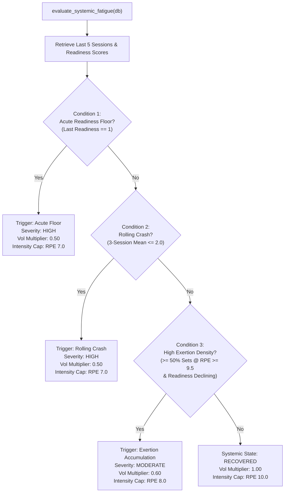

# Myos: Biomechanical Progression Rules, Quantization & Auto-Regulation Reference

This document formalizes the mathematical formulations, physiological heuristics, and algorithmic rules governing the Myos auto-regulation engine (`agent/progression_engine.py`, `agent/plate_calculator.py`, and `agent/program_rules.py`).

---

## 1. Dynamic RPE & Effective 1RM Formulation

Standard strength-training trackers rely on static Epley 1RM estimates based purely on repetitions to failure:

$$\text{e1RM}_{\text{Epley}} = w \cdot \left(1 + \frac{r}{30}\right)$$

In submaximal hypertrophy training, true muscular failure ($\text{RPE } 10$) is avoided on compound movements to manage systemic neurological and connective tissue fatigue. Myos calculates **effective repetitions** by projecting repetitions in reserve ($\text{RIR} = 10 - \text{RPE}$) into standard work capacity:

$$\text{effective\_reps} = r + (10 - \text{RPE})$$

The dynamic estimated 1RM ($\text{e1RM}$) is computed as:

$$\text{e1RM} = w \cdot \left(1 + \frac{r + (10 - \text{RPE})}{30}\right)$$

### Invariant Constraints
* If $\text{reps} = 1$ and $\text{RPE} = 10.0$, $\text{effective\_reps} = 1$, yielding $\text{e1RM} = w \cdot (1 + 1/30) \approx 1.033w$.
* For pure unweighted movements ($w = 0$), $\text{e1RM} = 0.0$.
* Repetition caps: For auto-regulation calculations, sets with $r > 20$ are bounded to avoid systemic cardiovascular degradation from distorting maximal strength projections.

---

## 2. Double Progression Corridors & Target Load Projection

Myos applies a double progression framework inside prescribed repetition brackets $[R_{\min}, R_{\max}]$ (e.g., 6–10 reps, 8–12 reps). The progression engine determines load step actions based on the trainee's execution envelope:

```
                                  [ Working Set Logged ]
                                             |
                                             v
                           +-----------------------------------+
                           |  r = reps, e = RPE, w = load      |
                           +-----------------+-----------------+
                                             |
                  +--------------------------+--------------------------+
                  |                                                     |
         (e >= 10.0 & Target <= 8.5)                                (Normal)
                  |                                                     |
                  v                                                     v
      [ RPE_OVERSHOOT_DELOAD ]                                          |
      Load Step: -2.5 kg                                                |
                                                                        |
                  +-----------------------------------------------------+
                  |
                  +------------------------+----------------------------+
                  |                                                     |
        (r >= R_max & e <= Target)                         (r >= R_min & e <= Target - 1.5)
                  |                                                     |
                  v                                                     v
          [ PROGRESSION_UP ]                                   [ DYNAMIC_UPSCALE ]
      Load Step: +Increment                                Load Step: +Increment (Reserve Step)
                  |                                                     |
                  +--------------------------+--------------------------+
                                             |
                                          (Else)
                                             |
                                             v
                                     [ CONSOLIDATING ]
                                 Load Step: Maintain Load
                                 Target Reps: min(r + 1, R_max)
```


### Progression State Transitions

| State Code | Condition | Load Mutation ($\Delta w$) | Next Target Rep Directive |
| :--- | :--- | :---: | :--- |
| `PROGRESSION_UP` | $r \ge R_{\max} \land \text{RPE} \le \text{target\_rpe}$ | $+ \text{Increment}$ | Reset target to $R_{\min}$ at elevated load. |
| `DYNAMIC_UPSCALE` | $r \ge R_{\min} \land \text{RPE} \le (\text{target\_rpe} - 1.5)$ | $+ \text{Increment}$ | Advance load early due to velocity reserve. |
| `RPE_OVERSHOOT_DELOAD` | $\text{RPE} \ge 10.0 \land \text{target\_rpe} \le 8.5$ | $- 2.5\text{ kg}$ | Drop load to re-establish $1\text{–}2$ RIR safety margin. |
| `CONSOLIDATING` | $r < R_{\max} \land \text{RPE} \approx \text{target\_rpe}$ | $\pm 0.0\text{ kg}$ | Maintain load; push for $\min(r + 1, R_{\max})$ reps. |

### Equipment-Specific Increments ($\text{Increment}$)
* **Barbell Exercises**: Snapped to $2.5\text{ kg}$ (minimum standard plate jump of $1.25\text{ kg}$ per side).
* **Dumbbell Exercises**: $2.0\text{ kg}$ total ($1.0\text{ kg}$ per hand jump).
* **Cable / Machine Variations**: Snapped to $2.5\text{ kg}$ stack pin increments.

### Soft Progression Ceiling / Anomaly Thresholds
To prevent accidents caused by typographical entry errors, an anomaly alert triggers if:
1. Projected jump $\Delta w \ge 5.0\text{ kg}$ on upper body lifts or $\ge 10.0\text{ kg}$ on lower body lifts.
2. Projected jump represents $\ge 10\%$ total load increase over the previous session's top set:
   $$\frac{\Delta w}{w_{\text{prev}}} \ge 0.10$$

---

## 3. Olympic Barbell Plate Quantization Engine

Calculated loads must map directly to physical equipment increments. Decimal targets (e.g., $73.3\text{ kg}$) create manual plate math friction during training.

### 1. Symmetric Load Snapping
All barbell targets snap to symmetric $2.5\text{ kg}$ steps:

$$w_{\text{snapped}} = 2.5 \times \left\lfloor \frac{w + 1.25}{2.5} \right\rfloor$$

### 2. Per-Side Greedy Descent Algorithm
Given standard Olympic bar weight $w_{\text{bar}} = 20.0\text{ kg}$ and disc inventory:

$$\mathcal{P} = [25.0, 20.0, 15.0, 10.0, 5.0, 2.5, 1.25]\text{ kg}$$

The required load per side is computed as:

$$w_{\text{side}} = \frac{w_{\text{snapped}} - w_{\text{bar}}}{2}$$

If $w_{\text{snapped}} \le w_{\text{bar}}$, $w_{\text{side}} = 0$, and the plate list returns `"Bar Only"`. Otherwise, plates match via greedy subtraction:

$$\text{count}(p) = \left\lfloor \frac{w_{\text{remaining}}}{p} \right\rfloor, \quad \forall p \in \mathcal{P}$$

$$w_{\text{remaining}} \leftarrow w_{\text{remaining}} - (\text{count}(p) \cdot p)$$

### Example Quantizations
* **Target $100.0\text{ kg}$**: $w_{\text{side}} = (100 - 20) / 2 = 40.0\text{ kg} \implies [25.0, 15.0]\text{ kg/side}$.
* **Target $82.5\text{ kg}$**: $w_{\text{side}} = (82.5 - 20) / 2 = 31.25\text{ kg} \implies [25.0, 5.0, 1.25]\text{ kg/side}$.
* **Target $20.0\text{ kg}$**: $w_{\text{side}} = 0.0\text{ kg} \implies \text{Bar Only}$.

---

## 4. Potentiating Warmup Ramp Protocol

To prepare neuromuscular recruitment without accumulating metabolic fatigue, Myos generates a 3-tier potentiating warmup ramp for primary compound movements ($R_{\min} \le 8$ or the first movement of a training session):

```
  % of Working Load
  100% |                                               [ WORKING SETS ]
       |                                               (Target Weight)
   85% |                                   [ W3: 1 Rep ]
       |                               (Potentiation Single)
   65% |                   [ W2: 3 Reps ]
       |               (Acceleration Intent)
   40% |   [ W1: 5 Reps ]
       | (Pattern Warmup)
    0% +-------------------------------------------------------------> Time
```


| Warmup Tier | Intensity (% of Top Load) | Target Repetitions | Physiological Focus | Plate Snapping Rule |
| :---: | :---: | :---: | :--- | :--- |
| **Set W1** | $40\%$ | 5 reps | Motor pattern calibration, synovial fluid lubrication. | Snapped to $2.5\text{ kg}$ (min: $20.0\text{ kg}$). |
| **Set W2** | $65\%$ | 3 reps | Maximal compensatory acceleration intent. | Snapped to $2.5\text{ kg}$. |
| **Set W3** | $85\%$ | 1 rep | Post-activation potentiation (PAP), zero metabolic fatigue. | Snapped to $2.5\text{ kg}$. |

---

## 5. Fractional Synergist Volume Attribution

Conventional tracking systems either count volume exclusively for prime movers or assign a full $1.0$ set to all involved muscles, causing significant volume distortion.

Myos scores systemic weekly volume using fractional attribution:

```
               [ Multi-Joint Exercise Executed (e.g., Incline Bench Press) ]
                                              |
                     +------------------------+------------------------+
                     |                                                 |
                     v                                                 v
           [ Primary Prime Mover ]                           [ Secondary Synergists ]
             (target_muscle: Chest)                           (exercise_secondary_muscles)
                     |                                                 |
                     v                                                 v
           Volume Credit = 1.0 Set                           Volume Credit = 0.5 Sets
                                                                       |
                                                      +----------------+----------------+
                                                      |                                 |
                                                      v                                 v
                                              (Anterior Deltoid)                    (Triceps)
                                                Credit: 0.5 Sets                 Credit: 0.5 Sets
```


### Relational Schema & Deduplication
Volume aggregates over a rolling 7-day window via `get_weekly_muscle_volume()`:
* Primary target muscles receive **$1.0$ set** per completed working set (`ws.is_warmup = 0`).
* Secondary muscles retrieved from `catalog.exercise_secondary_muscles` receive **$0.5$ sets**.
* **Deduplication Rule**: If a movement's secondary muscle list contains multiple regional heads that map to the same parent muscle group (e.g., *Trapezius Upper* and *Trapezius Lower* mapping to *Back*), the parent muscle group receives credit exactly once ($0.5$ sets total, never $1.0$).

---

## 6. Systemic Fatigue Diagnostics & Deload Triggers

Deload interventions are determined dynamically by physiological state vectors rather than arbitrary calendar intervals.




### Deload Prescription Parameters

When `deload_recommended == True`, Tab 2 automatically adjusts training targets:
1. **Set Volume Truncation**: Target working sets are multiplied by `volume_multiplier` (minimum 1 working set):
   $$\text{sets}_{\text{deload}} = \max\left(1, \text{round}\left(\text{target\_sets} \times \text{volume\_multiplier}\right)\right)$$
2. **RPE Ceiling Clamping**: The maximal permitted target RPE is capped:
   $$\text{RPE}_{\text{target}} = \min(\text{prescribed\_rpe}, \text{intensity\_cap\_rpe})$$
3. **Telemetry State Flagging**: The state snapshot injected into the LLM system prompt switches to `[DELOAD RECOMMENDED]`, instructing the assistant to emphasize recovery compliance.

---

## 7. Clinical Red-Flag Interception Boundaries

Myos strictly separates biomechanical auto-regulation from medical diagnosis. The clinical safeguard pattern set (`RE_ACUTE_INJURY`) bypasses all progression logic and halts generation in $<0.02\text{ ms}$:

```python
RE_ACUTE_INJURY = re.compile(
    r"\b(sharp pop|popped|tore|torn|snapped|shooting pain|numbness|tingling|joint swelling|severe pain)\b",
    re.IGNORECASE,
)
```


### Protocol Action
* **Zero Model Invocation**: Queries containing these terms never reach `SafeChatLlamaCpp`.
* **Immediate Cease Directive**: The system yields an immutable clinical stop directive instructing the trainee to immediately deload the bar, cease loading the affected kinetic chain, and consult a qualified medical professional.